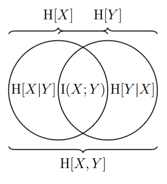

离散数学与结构 (2025Fall) 信息论部分的笔记 (第一部分)。

## 熵，互信息

**定义**：设随机变量 $X \sim P_X$，定义
$$
\mathrm{H}[X] = \sum_x P_X(x) \log \frac{1}{P_X(x)} = \mathbb{E}_{X \sim P_X} \left[ \log \frac{1}{P_X(X)} \right]
$$
称为 $X$ 的**熵 (Entropy) **．$\mathrm{H}[X]$ 也可写作 $\mathrm{H}[P_X]$．(留意上式最后一个等号后面存在两个不同含义的 $X$，不至引起歧义．)

$\log$ 在这里留空底数，表明我们可以根据需要去选取．如果底数为 $2$，那熵的单位就是比特(bit)；如果是 $\mathrm{e}$，那么就是 nit．当我们写下 $\log$ 时，默认 $\exp$ 使用与之相同的底数．

熵是衡量随机变量不确定性的量．简单的例子：
- $X \sim \mathrm{Unif}(\Omega)$，那么 $\mathrm{H}[X] = \log |\Omega|$．
- $X \sim \mathrm{Bern}(p)$，那么 $\mathrm{H}[X] = p\log \frac{1}{p} + (1-p)\log \frac{1}{1-p}$，常将此记作 $h(p)$．特别地，$p = \frac{1}{2}$ 时 $\mathrm{H}[X] = 1$ bit．

**命题**：$0 \le \mathrm{H}[X] \le \log |X|$，这里 $|X|$ 是支撑集 $\{x | P_X(x) > 0\}$ 的大小．

**证明**：左侧较平凡，是 $0 \le P_X(x) \le 1$ 的缘故，右侧利用 $\log$ 的凸性使用 Jensen 不等式．

**定义**：给定随机变量 $X$ 和 $Y$ 及其联合分布 $P_{XY}$．定义
$$
\mathrm{H}[X, Y] = \sum_{x, y} P_{XY}(x, y)\log \frac{1}{P_{XY}(x, y)} = \mathbb{E}_{X,Y \sim P_{XY}} \left[ \log \frac{1}{P_{XY}(X,Y)} \right]
$$
称为其**联合熵 (Joint Entropy) **．

**定义**：给定随机变量 $X$ 和 $Y$，定义
$$
\begin{align*}
\mathrm{H}[Y|X] &= \sum_x \Pr[X = x] \mathrm{H}[Y|X = x] \\
&= \sum_x P_X(x) \sum_y P_{Y|X}(y|x) \log \frac{1}{P_{Y|X}(y|x)} \\
&= \sum_{x, y} P_{XY}(x, y) \log \frac{1}{P_{Y|X}(y|x)} \\
&= \mathbb{E}_{X, Y \sim P_{XY}} \left[\log \frac{1}{P_{Y|X}(y|x)}\right]
\end{align*}
$$
称为**条件熵 (Conditional Entropy) **．

熵，联合熵与条件熵有三点简单的性质：

**命题**：$\mathrm{H}[X, Y] = \mathrm{H}[X] + \mathrm{H}[Y|X]$

**证明**：代入定义，会发现就是 $P_{XY}(x, y) = P_X(x)P_{X|Y}(x|y)$ 和 $P_X(x) = \sum_y P_{XY}(x, y)$ 的简单应用．

注：这一条也可以推广到 $n$ 个变量的情形：$\mathrm{H}[X_1, \dots, X_n] = \mathrm{H}[X_1] + \mathrm{H}[X_2 | X_1] + \dots + \mathrm{H}[X_n | X_1, \dots, X_{n-1}]$．

**命题**：$\mathrm{H}[X|Y] \le \mathrm{H}[X]$．

**证明**：作差，用 $P_X(x) = \sum_y P_{XY}(x, y)$ 展开 $\mathrm{H}[X]$，有：
$$
\begin{align*}
\mathrm{H}[X] - \mathrm{H}[X|Y] &= \sum_x P_X(x) \log \frac{1}{P_X(x)} - \sum_{x, y} P_{XY} (x, y) \log \frac{1}{P_{X|Y}(x|y)} \\
&= \sum_{x, y} P_{XY}(x, y) \log \frac{P_{X|Y}(x|y)}{P_X(x)} \\
&= \sum_{x, y} P_{XY}(x, y) \log \frac{P_{XY}(x, y)}{P_Y(y) P_X(x)} \\
&= \sum_{x, y} P_Y(y) P_X(x) \frac{P_{XY}(x, y)}{P_Y(y) P_X(x)} \log \frac{P_{XY}(x, y)}{P_Y(y) P_X(x)}
\end{align*}
$$
利用 $f(x) = x \log x$ 的凸性，使用加权的 Jensen 不等式即可，留意到 $\sum_{x, y} P_{XY}(x, y) = 1$ 和 $\sum_x \sum_y P_X(x) P_Y(y) = \sum_x P_X(x) \sum_y P_Y(y) = 1$．

**命题**：$\mathrm{H}[X] \ge \mathrm{H}[f(X)]$．

**证明**：由于 $\mathrm{H}[X, f(X)] = \mathrm{H}[f(X)|X] + \mathrm{H}[X]$，而 $f(X)$ 由 $X$ 唯一确定，故条件熵 $\mathrm{H}[f(X)|X] = 0$ (表达式中的条件概率要么是 $0$ 要么是 $1$) ，因此 $\mathrm{H}[X] = \mathrm{H}[X, f(X)]$．又因为 $\mathrm{H}[X, f(X)] = \mathrm{H}[f(X)] + \mathrm{H}[X|f(X)] \ge \mathrm{H}[f(X)]$ (条件熵总是非负) ，所以 $\mathrm{H}[X] \ge \mathrm{H}[f(X)]$．

这两个命题的意义很明显：引入另一个变量的前提条件或引入确定性的函数均不会增加信息．

**定义**：定义 $X$ 和 $Y$ 的**互信息 (Mutual Information) **为
$$
\mathrm{I}(X; Y) = \mathrm{H}[X] + \mathrm{H}[Y] - \mathrm{H}[X, Y] = \mathrm{H}[X] - \mathrm{H}[X|Y] = \mathrm{H}[Y] - \mathrm{H}[Y|X]
$$

互信息也可以推广到条件互信息：

**定义**：设 $X$，$Y$，$Z$ 为随机变量，定义条件互信息为 
$$
\mathrm{I}(X;Y|Z) = \mathrm{H}[X|Z] + \mathrm{H}[Y|Z] - \mathrm{H}[X,Y|Z] = \mathrm{H}[X|Z] - \mathrm{H}[X|Y,Z]
$$

互信息同样有链式法则：

**定理**：$\mathrm{I}(X;Y_1,\dots,Y_n) = \mathrm{I}(X;Y_1) + \mathrm{I}(X;Y_2|Y_1) + \dots + \mathrm{I}(X;Y_n|Y_1\dots Y_{n-1})$

上面其实已经证明了

**定理**：$\forall X, Y$，$\mathrm{I}(X;Y) \ge 0$．

容易证明条件互信息也非负．但是条件互信息 $\mathrm{I}(X;Y|Z)$ 和互信息 $\mathrm{I}(X;Y)$ 之间没有确定的大小关系，我们只能证明：

**定理**：$\mathrm{I}(X;Y|Z) \le \mathrm{I}(X;Y) + \mathrm{H}[Z]$．

**证明**：我们有 $\mathrm{I}(X;Y|Z) = \mathrm{I}(X;Y,Z) - \mathrm{I}(X;Z) \le \mathrm{I}(X;Y,Z)$ 和 $\mathrm{I}(X;Y,Z) = \mathrm{I}(X;Z|Y) + \mathrm{I}(X;Y) \le \mathrm{H}[Z|Y] + \mathrm{I}(X;Y) \le \mathrm{H}[Z] + \mathrm{I}(X;Y)$．

以上我们定义过的量 (除条件互信息之外) 可以方便地表示为下面的 Venn 图：

下面我们关注所谓的数据处理不等式(Data Processing Inequality)．所谓“数据处理”，指的是三个随机变量 $X$，$Y$ 和 $Z$ 之间满足 $P_{XYZ} = P_{X} P_{Y|X} P_{Z|Y}$，换言之 $X \to Y \to Z$ 构成 Markov 链．利用条件概率的性质，不难说明以下三种关系等价：
- $X \to Y \to Z$，也即 $P_{XYZ} = P_{X} P_{Y|X} P_{Z|Y}$；
- $X \leftarrow Y \to Z$，也即 $P_{XYZ} = P_{Y} P_{X|Y} P_{Z|Y}$；
- $X \leftarrow Y \leftarrow Z$，也即 $P_{XYZ} = P_{Z} P_{Y|Z} P_{X|Y}$；

等价的说法也可以是 $P_{Z|X,Y} = P_{Z|Y}$，或者 $P_{X|Y,Z} = P_{X|Y}$ 等．

**定理**：设随机变量 $X$，$Y$，$Z$ 之间满足 $P_{XYZ} = P_{X} P_{Y|X} P_{Z|Y}$，那么 $\mathrm{I}(X;Y) \ge \mathrm{I}(X;Z)$．

**证明**：原不等式等价于 $\mathrm{H}[X|Y] \le \mathrm{H}[X|Z]$，而
$$
\mathrm{H}[X|Y] = \sum_y P_Y(y) \sum_x P_{X|Y}(x|y) \log \frac{1}{P_{X|Y}(x|y)}
$$
$$
\mathrm{H}[X|Z] = \sum_z P_Z(z) \sum_x P_{X|Z}(x|z) \log \frac{1}{P_{X|Z}(x|z)}
$$
而利用 Markov 性，$P_{X|Y,Z} = P_{X|Z}$，进而
$$
\begin{align*}
P_{X|Z}(x|z) &= \sum_y P_{X,Y|Z}(x,y|z) \\
&= \sum_y P_{X|Y,Z}(x|y,z) P_{Y|Z}(y|z) \\
&= \sum_y P_{X|Y}(x|y) P_{Y|Z}(y|z)
\end{align*}
$$
利用 $x\log x$ 的凸性，有：
$$
\begin{align*}
\mathrm{H}[X|Z] &\ge \sum_z P_Z(z) \sum_x \sum_y P_{Y|Z}(y|z) P_{X|Y}(x|y) \log \frac{1}{P_{X|Y}(x|y)} \\
&= \sum_y P_Y(y) \sum_x P_{X|Y}(x|y) \log \frac{1}{P_{X|Y}(x|y)} \\
&= \mathrm{H}[X|Y]
\end{align*}
$$

## KL 散度

“散度”这个词指的是两个分布之间的“距离”．一种朴素的想法是直接使用 L1 距离，也就是 $\sum_x \frac{1}{2}|P(x) - Q(x)|$，它在一些场合下当然不太好．我们引入如下的定义：

**定义**：设 $P$ 和 $Q$ 是两个概率函数，那么定义 $P$ 对 $Q$ 的** KL 散度 (Kullback-Leibler Divergence) **为
$$
\mathrm{D}(P||Q) = \sum_x P(x) \log \frac{P(x)}{Q(x)} = \mathbb{E}_{x\sim P} \left[ \log \frac{P(x)}{Q(x)} \right] = \mathbb{E}_{x\sim Q} \left[\frac{P(x)}{Q(x)} \log \frac{P(x)}{Q(x)}\right]
$$
如果 $P(x)$ 或 $Q(x)$ 为 $0$，对应的项自然地补充定义为 $0$ 或 $+\infty$．

留意到 KL 散度并不是对称的，它衡量的是 $P$ 偏离 $Q$ 的程度．

**命题**：对任何 $P$，$Q$，$\mathrm{D}(P||Q) \ge 0$．

**证明**：利用 $\mathrm{D}(P||Q) = \mathbb{E}_{x\sim Q} \left[\frac{P(x)}{Q(x)} \log \frac{P(x)}{Q(x)}\right]$ 和 $x\log x$ 的凸性．

简单的例子：

- $\mathrm{D}(P||\mathrm{Unif}(\Omega)) = \log(|\Omega|) - \mathrm{H}(P)$；
- $\mathrm{D}(\mathrm{Bern}(p)||\mathrm{Bern}(q)) = p\log\frac{p}{q} + (1-p)\log\frac{1-p}{1-q}$，常记作 $d(p||q)$．

散度也可以推广到条件散度．

**定义**：给定条件分布 $P_{Y|X}$ 和 $Q_{Y|X}$，设 $P_X$ 为边缘分布，那么定义**条件散度**为
$$
\mathrm{D}(P_{Y|X}||Q_{Y|X} | P_X) = \sum_x P_X(x) \mathrm{D}(P_{Y|X=x}||Q_{Y|X=x})
$$

将 $\mathrm{D}(P_{Y|X=x}||Q_{Y|X=x})$ 具体展开，不难得到
$$
\begin{align*}
\mathrm{D}(P_{Y|X}||Q_{Y|X} | P_X) &= \sum_x \sum_y P_{XY}(x,y) \log \frac{P_{Y|X}(y|x)}{Q_{Y|X}(y|x)} \\
&= \mathbb{E}_{X,Y\sim P_{XY}} \left[\log \frac{P_{Y|X}(Y|X)}{Q_{Y|X}(Y|X)} \right]
\end{align*}
$$

还可以写作

$$
\mathrm{D}(P_{Y|X}||Q_{Y|X} | P_X) = \mathrm{D}(P_{Y|X}P_{X}||Q_{Y|X}P_X)
$$

于是就有

**命题**：
$$
\mathrm{D}(P_{XY} || Q_{XY}) = \mathrm{D}(P_X||Q_X) + \mathrm{D}(P_{Y|X}||Q_{Y|X} | P_X)
$$

这个等式可以推广到更多随机变量的情形：
$$
\mathrm{D}(P_{X_1\dots X_n} || Q_{X_1\dots X_n}) = \sum_i \mathrm{D}(P_{X_i|X_1\dots X_{i-1}} || Q_{X_i|X_1 \dots X_{i-1}} | P_{X_1\dots X_{i-1}})
$$

从 KL 散度的非负性和条件散度的定义可以看出条件散度也非负，进而就有

**命题**：
$$
\mathrm{D}(P_{XY}||Q_{XY}) \ge \mathrm{D}(P_X||Q_X)
$$

换言之边缘分布的散度总是不超过联合分布．条件分布和边缘分布的散度一般没有确定的大小关系，但是如果是同一个源 $P_X$ 被两种条件分布 $P_{Y|X}$ 和 $Q_{Y|X}$ 分别处理，那么边缘分布的散度不超过条件分布：

**命题**：已知条件分布 $P_{Y|X}$ 和 $Q_{Y|X}$，如果其边缘分布 $P_X = Q_X$，那么
$$
\mathrm{D}(P_Y||Q_Y) \le \mathrm{D}(P_{Y|X} || Q_{Y|X} | P_X)
$$

**证明**：$\mathrm{D}(P_{Y|X} || Q_{Y|X} | P_X) = \mathrm{D}(P_X P_{Y|X} || P_X Q_{Y|X}) = \mathrm{D}(P_{XY} || Q_{XY}) \ge \mathrm{D}(P_Y||Q_Y)$．

散度函数本身具有凸性：

**定理**：$\forall P_0, P_1, Q_0, Q_1, \lambda \in [0, 1]$，
$$
(1-\lambda) \mathrm{D}(P_0||Q_0) + \lambda \mathrm{D}(P_1||Q_1) \ge \mathrm{D}((1-\lambda)P_0 + \lambda P_1 \ || \  (1-\lambda)Q_0 + \lambda Q_1)
$$

**证明**：引入联合分布 $P_{XZ}, Q_{XZ}$，满足 $P_Z = Q_Z = \mathrm{Bern}(\lambda)$，然后定义条件分布
- $P_{X|Z=0} = P_0, P_{X|Z=1} = P_1$；
- $Q_{X|Z=0} = Q_0, Q_{X|Z=1} = Q_1$;

此时 $P_X = \sum_z P_Z P_{X|Z} = (1 - \lambda)P_0 + \lambda P_1$，$Q_X = (1 - \lambda)Q_0 + \lambda Q_1$，进而
$$
\begin{align*}
\mathrm{D}(P_X || Q_X) &\le \mathrm{D}(P_{XZ}||Q_{XZ}) \\
&= \mathrm{D}(P_Z||Q_Z) + \mathrm{D}(P_{X|Z} || Q_{X|Z}) \\
&= 0 + \sum_z P_Z(z) \mathrm{D}(P_{X|Z=z}||Q_{X|Z=z}) \\
&= (1-\lambda) \mathrm{D}(P_0||Q_0) + \lambda \mathrm{D}(P_1||Q_1)
\end{align*}
$$

我们同样关心散度的数据处理不等式．考虑用一个相同的分布 $P_{Y|X}$ 去处理 $P_X$ 和 $Q_X$，那么这个过程中信息不会增加：

**定理**：假设有概率分布 $P_X$ 和 $Q_X$，$P_Y$ 和 $Q_Y$，如果条件分布 $P_{Y|X} = Q_{Y|X}$， 那么
$$
\mathrm{D}(P_X||Q_X) \ge \mathrm{D}(P_Y||Q_Y)
$$

**证明**：利用边缘分布的散度小于等于联合分布的散度，
$$
\begin{align*}
\mathrm{D}(P_Y||Q_Y) &\le \mathrm{D}(P_X P_{Y|X} || Q_X P_{Y|X}) \\
&= \mathrm{D}(P_X||Q_X) + 0 \\
&= \mathrm{D}(P_X||Q_X)
\end{align*}
$$

## Chernoff & Sanov 不等式

熵和 KL 散度本身可以作为一些集中不等式的界，给出非常好的估计．这里介绍 Chernoff Bound 和 Sanov Bound．

**定理 (Chernoff Bound)**：设 $X$ 为任意随机变量，那么
$$
\Pr[X \ge \alpha] \le \min_{t > 0} \frac{\mathbb{E}[\mathrm{e}^{tX}]}{\mathrm{e}^{t\alpha}}
$$

**证明**：使用 Markov 不等式．$\forall t > 0$，
$$
\Pr[X \ge \alpha] = \Pr[\mathrm{e}^{tX} \ge \mathrm{e}^{t\alpha}] \le \frac{\mathbb{E}[\mathrm{e}^{tX}]}{\mathrm{e}^{t\alpha}}
$$

下面将 Chernoff Bound 用于 Bernoulli 分布．设 $X_1, \dots, X_n \sim \mathrm{Bern}(p)$ 独立同分布，那么 $\mathbb{E}[\mathrm{e}^{tX_i}] = p\mathrm{e}^t + 1 - p$，于是 $\forall p < q \le 1$，有
$$
\begin{align*}
\Pr\left[\sum X_i \ge qn\right] &\le \min_{t>0} \frac{\mathbb{E}[\mathrm{e}^{t\sum X_i}]}{\mathrm{e}^{tqn}} \\
&= \min_{t>0} \left(\frac{p\mathrm{e}^t+1-p}{\mathrm{e}^{tq}}\right)^n
\end{align*}
$$
求导即知右侧内部函数在 $\mathrm{e}^t = \dfrac{q(1-p)}{p(1-q)}$ 时取最小值，代入整理得
$$
\begin{align*}
\Pr\left[\sum X_i \ge qn \right] &\le \left(\left(\frac{1-p}{1-q}\right)^{1-q} \left(\frac{p}{q}\right)^q\right)^n \\
&= \exp n\left((1-q)\log\frac{1-p}{1-q} + q\log \frac{p}{q}\right) \\
&= \exp (-nd(q||p))
\end{align*}
$$

当 $q < p$ 时，类似地，我们可以估计另一侧：

$$
\Pr\left[\sum X_i \le qn \right] \le \exp(-nd(q||p))
$$

在作业中我们证明了 $d(q||p) \ge 2 \log \mathrm{e} (p-q)^2$，所以上面的界可以进一步写成 $\mathrm{e}^{-2n(p-q)^2}$．总而言之，我们有

**命题**：设 $X_1, \dots, X_n \sim \mathrm{Bern}(p)$ 独立同分布，$q > p$，那么
$$
\Pr\left[\sum_{i=1}^n X_i \ge qn \right] \le \exp (-nd(q||p)) \le \mathrm{e}^{-2n(p-q)^2}
$$

特别地，对于 $p = \dfrac{1}{2}$，我们就得到了

$$
\Pr\left[\sum X_i \ge \frac{n}{2} + \lambda\sqrt{n} \right] \le \mathrm{e}^{-2\lambda^2}
$$

根据中心极限定理，$\sum X_i$ 近似服从于正态分布 $\mathcal{N}\left(\dfrac{n}{2},\dfrac{n}{4}\right)$，由此可看出这个不等式已经很好了．

下面的主题是 Sanov Bound．我们先来看 Sanov Bound 在 Bernoulli 分布上的一种形式：

**命题**：设 $X_1, \dots, X_n \sim \mathrm{Bern}(p)$ 独立同分布，$q > p$，那么
$$
\frac{1}{n+1} \exp(-nd(q||p)) \le \Pr\left[\sum_{i=1}^n X_i \ge qn \right] \le (n - nq + 1)\exp (-nd(q||p))
$$

下面的讨论过程为了简单将 $pn$ 和 $qn$ 视作整数．非整数对证明没什么影响，只是多套一些取整符号而已．

Sanov Bound 采用这样的想法：
$$
\begin{align*}
\Pr\left[\sum_{i=1}^n X_i \ge qn \right] &= \sum_{t=qn}^n \Pr\left[\sum X_i = t \right] \\
&= \sum_{t=qn}^n \binom{n}{t} p^t (1-p)^{n-t} \\
&\begin{cases}
\le (n - qn + 1) \max_{t \ge qn} \left\{ \binom{n}{t} p^t (1-p)^{n-t} \right\}\\
\ge \max_{t \ge qn} \left\{ \binom{n}{t} p^t (1-p)^{n-t} \right\}
\end{cases}
\end{align*}
$$
于是我们需要做的便是找到 $\max$ 并估计它的大小．利用作差或作商比较，容易说明 $\dbinom{n}{t} p^t (1-p)^{n-t}$ 先递增后递减，在 $t = pn$ 处取得最大值．而 $q > p$，故上式的最大值在 $t = qn$ 处取，因此我们将注意力放在对组合数 $\dbinom{n}{qn}$ 的估计上即可．

先来点感性的估计：

$$
\begin{align*}
\binom{n}{t} &= \frac{n!}{t!(n-t)!} \\
&\approx \frac{\sqrt{2\pi n} \left(\frac{n}{\mathrm{e}}\right)^n}{\sqrt{2\pi t} \left(\frac{t}{\mathrm{e}}\right)^t \sqrt{2\pi (n-t)} \left(\frac{n-t}{\mathrm{e}}\right)^{n-t}} \\
&\approx \left(\frac{n}{t}\right)^t \left(\frac{n}{n-t}\right)^{n-t} \\
&= \exp\left(nh\left(\frac{t}{n}\right)\right)
\end{align*}
$$

下面来严格化这个过程．假设我们取 $X_1, \dots, X_n \sim \mathrm{Bern}(q)$，那么：
$$
\begin{align*}
&\Pr\left[\sum X_i = qn \right] \le 1 \\
&\Rightarrow \binom{n}{qn} q^{qn} (1-q)^{n-qn} \le 1 \\
&\Rightarrow \binom{n}{qn} \le \frac{1}{q^{qn} (1-q)^{n-qn}} \\
&\phantom{\Rightarrow \binom{n}{qn}} = \left(\left(\frac{1}{q}\right)^q \left(\frac{1}{1-q}\right)^{1-q}\right)^n \\
&\phantom{\Rightarrow \binom{n}{qn}} = \exp(nh(q))
\end{align*}
$$

其次，我们知道 $\dbinom{n}{t} q^t (1-q)^{n-t}$ 在 $t = qn$ 处取最大值，于是
$$
\begin{align*}
&\Pr\left[\sum X_i = qn \right] \ge \Pr\left[\sum X_i = t \right], \forall t \\
&\Rightarrow \sum_{t=0}^n \Pr\left[\sum X_i = qn \right] \ge \sum_{t=0}^n \Pr\left[\sum X_i = t \right] \\
&\Rightarrow (n+1)\Pr\left[\sum X_i = qn \right] \ge 1 \\
&\Rightarrow \Pr\left[\sum X_i = qn \right] \ge \frac{1}{n+1} \\
&\Rightarrow \binom{n}{qn} \ge \frac{1}{n+1} \exp(nh(q))
\end{align*}
$$

将我们得到的两边的界代入回一开始的不等式，注意到
$$
\begin{align*}
\exp(nh(q)) \cdot p^{qn} (1-p)^{n-qn} &= \exp(nh(q)) \cdot \exp(n(q\log p + (1-q)\log (1-p))) \\
&= \exp (-nd(q||p))
\end{align*}
$$

我们就证明了一开始的 Sanov Bound．

有了这个例子，我们来看一般情况下的 Sanov Bound．设样本空间 $\Omega = \{v_1, \dots, v_L\}$，概率分布 $P: \Omega \to [0, 1]$，记 $p_i = P(v_i)$．独立地取 $X_1, \dots, X_n \sim P$．给定函数 $S: \Omega \to \mathbb{N}$，记 $s_i = S(v_i)$，且 $\sum_i s_i = n$．如果 $X_1, \dots, X_n$ 中恰好有 $s_i$ 个 $v_i$，就称 $(X_1, \dots, X_n)$ 的 type (型)  是 $S$．Sanov Bound 给出 type 落在某个具体集合中的概率的估计：

**定理 (Sanov Bound)**：给定概率分布 $P: \Omega \to [0, 1]$，$\Omega = \{v_1, \dots, v_L\}$，随机变量 $X_1, \dots, X_n \sim P$ 独立同分布．那么，对于某个 type 的集合 $A$，有
$$
\begin{align*}
\frac{1}{(n+1)^{L-1}} \max_{S\in A} \exp(-n\mathrm{D}(Q_S||P)) &\le \Pr[\mathrm{type}(X_1, \dots, X_n) \in A] \\
&\le (n+1)^{L-1} \max_{S\in A} \exp(-n\mathrm{D}(Q_S||P))
\end{align*}
$$
这里分布 $Q_S$ 由 $Q_S(v_i) = S(v_i) / n$ 确定．

**证明**：证明其实就是之前对于 Bernoulli 的情形的翻版．首先，type 的数量总共不超过 $(n+1)^{L-1}$ 个 (对每个 $i$，$S(v_i) \in \{0, \dots, n\}$ 有 $n+1$ 种取法，第 $L$ 个由前 $L-1$ 个确定；实际上比这个值小得多) ，故 $|A| \le (n+1)^{L-1}$．于是，
$$
\begin{align*}
\Pr[\mathrm{type}(X_1, \dots, X_n) \in A] &= \sum_{S \in A} \Pr[\mathrm{type}(X_1, \dots, X_n) = S] \\
&\begin{cases}
\le (n+1)^{L-1} \max_{S \in A} \Pr[\mathrm{type}(X_1, \dots, X_n) = S] \\
\ge \max_{S \in A} \Pr[\mathrm{type}(X_1, \dots, X_n) = S]
\end{cases}
\end{align*}
$$
对于给定的 $S$，有
$$
\Pr[\mathrm{type}(X_1, \dots, X_n) = S] = \binom{n}{s_1 \ \dots \ s_L} p_1^{s_1} \dots p_L^{s_L}
$$
于是只需要估计组合数 $\dbinom{n}{s_1 \ \dots \ s_L}$．构造分布 $Q$ 使 $Q(v_i) = s_i / n$ 将其记作 $q_i$，并且另取 $Z_1, \dots, Z_n \sim Q$ 独立同分布，那么
$$
\begin{align*}
&\Pr[\mathrm{type}(Z_1, \dots, Z_n) = S] \le 1 \\
&\Rightarrow \binom{n}{s_1 \ \dots \ s_L} \le \left(\left(\frac{1}{q_1}\right)^{q_1} \dots \left(\frac{1}{q_L}\right)^{q_L}\right)^n \\
&\phantom{\Rightarrow \binom{n}{s_1 \ \dots \ s_L}} = \exp(n\mathrm{H}(Q))
\end{align*}
$$
同时对于 $Q$ 而言，$S$ 是最大可能的 type，因而
$$
\begin{align*}
&\Pr[\mathrm{type}(Z_1, \dots, Z_n) = S] \ge \frac{1}{(n+1)^{L-1}} \\
&\Rightarrow \binom{n}{s_1 \ \dots \ s_L} \ge \frac{1}{(n+1)^{L-1}} \exp(n\mathrm{H}(Q))
\end{align*}
$$
简单的计算表明
$$
\exp(n\mathrm{H}(Q)) \cdot p_1^{s_1} \dots p_L^{s_L} = \exp(-n\mathrm{D}(Q||P))
$$
故对所有的 $S$ 均有
$$
\frac{1}{(n+1)^{L-1}}\exp(-n\mathrm{D}(Q_S||P)) \le \Pr[\mathrm{type}(X_1, \dots, X_n) = S] \le \exp(-n\mathrm{D}(Q_S||P))
$$
代回一开始的估计式就证明了 Sanov Bound．