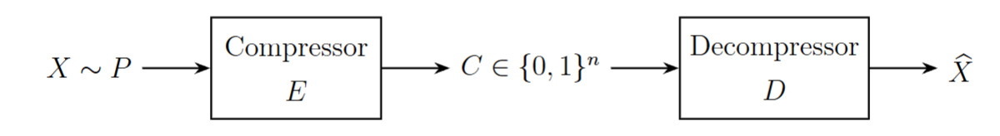
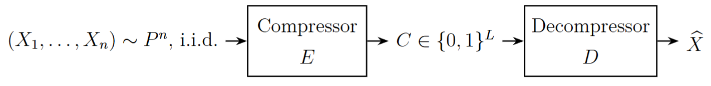
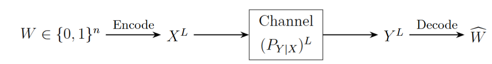

离散数学与结构 (2025Fall) 信息论部分的笔记 (第二部分)。

## 压缩

注：本节开始熵一律使用 $2$ 作为底数．

考虑如下的过程：

将随机变量编码为 01 字符串，我们希望编码和解码 (也就是压缩和解压缩) 过程是无损的，也就是 $D(E(x)) = x$，同时 $C$ 的期望长度 $\mathbb{E}[\mathrm{len}(C)]$ 尽可能小．

先看变长无损压缩 (Variable-length lossless compression) ．记 $\mathrm{Supp}_X = \{x_1, x_2, \dots\}$ 为 $X$ 的支撑集，满足 $P(x_i) \ge P(x_{i+1})$，即概率从高到底排列．同时，将所有字符串按长度排序为 $\{0, 1\}^* = \{\varnothing, 0, 1, 00, 01, 10, 11, 000, \dots\}$．一种直接的想法就是让概率最高的对应最短的字符串，以此类推，也即 $E(x_{1b_1\dots b_k}) = b_1\dots b_k$，我们称之为最优压缩 (Optimal compressor) ．

**定理**：对于最优压缩，记 $L(X) = \mathrm{len}(E(X))$，有
$$
\mathrm{H}(X) - \mathrm{H}(L) \le \mathbb{E}[L] \le \mathrm{H}(X)
$$

**证明**：易见 $P(x_i) \le 1/i$ 和 $L(x_i) = \lfloor \log_2 i \rfloor$, 于是
$$
\mathbb{E}[L] = \sum_i P(x_i)L(x_i) \le \sum_i P(x_i) \log_2 i \le \sum_i P(x_i)\log_2 \frac{1}{P(x_i)} = \mathrm{H}(X)
$$
对于另一侧，由于长度为 $l$ 的 01 字符串只有 $2^l$ 个，
$$
\mathrm{H}(X|L) = \sum \Pr[L=l] \mathrm{H}(X|L=l) \le \sum \Pr[L=l] \log_2 2^l = \mathbb{E}[L]
$$
所以
$$
\mathrm{H}(X) = \mathrm{H}(X, L) = \mathrm{H}(X|L) + \mathrm{H}(L) \le \mathbb{E}[L] + \mathrm{H}(L)
$$

注：实际上可以证明 $\mathrm{H}(L) \le \log_2 (\mathrm{e}(1 + \mathrm{H}(X)))$．

一个 Compressor $f: A \to \{0, 1\}^*$ 可以自然延拓为 $f: A^* \to \{0, 1\}^*$，使得 $f(a_1 \dots a_n) = f(a_1) \dots f(a_n)$，乘法为字符串的拼接．在这种情况下，最优压缩就存在无法正确解压的问题，不同的分割字符串的方式可能带来不同的结果．于是接下来我们考虑可唯一解码的编码 (Uniquely Decodable Code) ，其中的一种就是前缀码 (Prefix-free Code) ．前缀码要求 $\forall x \neq y$，$f(x)$ 不是 $f(y)$ 的前缀，以此保证解码的唯一性．

**定理**：给定函数 $L: A \to \mathbb{N}$，存在一种前缀码 $f$ 使得 $L(x_i) = \mathrm{len}(f(x_i))$ 当且仅当 $\sum_{x_i \in A} 2^{-L(x_i)} \le 1$．

**证明**：假设 $f$ 存在．随机取某个无穷长字符串 $s$，首先长度为 $l$ 的字符串是它的前缀的概率是 $1/2^l$，其次两个不同的字符串不可能同时是它的前缀，因此
$$
\Pr[\text{某个 $f(x_i)$ 是 $s$ 的前缀}] = \sum_{x_i \in A} 2^{-L(x_i)} \le 1
$$
对于另一个方向，直接按照长度从小到大的顺序去构造二叉树即可．

最优的前缀码即为熟知的 Huffman 编码 (Huffman Code) ，通过归纳可以证明其最优性 (假设 $n-1$ 时最优；对于 $n$，如果 $x_{n-1}$ 和 $x_n$ 在二叉树上不是兄弟，总能适当地交换使其成为兄弟而总期望编码长度不增) ．Huffman 编码有这样的性质：

**定理**：对于 Huffman 编码，$\mathrm{H}(X) \le \mathbb{E}[L(X)] \le \mathrm{H}(X) + 1$．

**证明**：先证明上界．取 $L'(x) = \lceil \log_2 \frac{1}{P(x)} \rceil$，易见 $L'$ 符合上面的定理，故存在以 $L'$ 为长度函数的前缀码，因此
$$
\mathbb{E}[L'(X)] \le \mathbb{E}\left[\log_2 \frac{1}{P(X)} + 1\right] = \mathrm{H}(X) + 1
$$
由于 Huffman 编码的最优性，
$$
\mathbb{E}[L(X)] \le \mathbb{E}[L'(X)] \le \mathrm{H}(X) + 1
$$

再证明下界，记 $Y = f(X)$，我们将 $Y$ 拓展为无穷长字符串，方式是向后面添加无穷多 $\bot$：
$$
\widetilde{Y}_i = \begin{cases} 
Y_i, & i \le \mathrm{len}(Y) \\ 
\bot, & i > \mathrm{len}(Y) 
\end{cases}
$$

以下直接将 $\widetilde{Y}$ 记作 $Y$．此时，因为解码完毕后下一位一定是 $\bot$，如果未完毕，下一位只有 01 两种可能，熵不超过 $1$ 比特，我们有
$$
\mathrm{H}(Y_t | Y_1\dots Y_{t-1} = y_1 \dots y_{t-1}) \begin{cases} 
=0, & \text{如果 $y_1 \dots y_{t-1}$ 中含有可行编码，已经解码完毕} \\ 
\le 1, & \text{otherwise} 
\end{cases}
$$
$$
\mathrm{H}(Y_t|Y_1\dots Y_{t-1}) \le \Pr[\text{解码已经完成}] = \Pr[\mathrm{len}(Y) \ge t]
$$
$$
\mathrm{H}(X) = \mathrm{H}(Y) = \sum_t \mathrm{H}(Y_t | Y_1\dots Y_{t-1}) \le \sum_t \Pr[\mathrm{len}(Y) > t] = \mathbb{E}[\mathrm{len}(Y)]
$$

 (注：直接作差 $\mathrm{H}(X) - \mathbb{E}[L(X)] = \sum P(x) \log_2 \dfrac{2^{-L(x)}}{P(x)}$ 用 Jensen 不等式好像更直接．) 

下面考虑几乎无损压缩 (Almost Lossless Compression) ：

不再要求解压完全准确，而只是希望 $\Pr[D(E(X)) = X] \ge 1 - \epsilon$，$\epsilon$ 是某个很小的数，编码长度限制为 $L$．采取的措施可以是将 $(\mathrm{Supp}_X)^n$ 按概率 $P^n(X)$ 排好序，为前若干个分配编码，后面的直接舍弃．

具体地说，对 $\vec{X} = (X_1, \dots, X_n)$，考虑 $-\log P^n(\vec{X}) = \sum_i -\log P(X_i)$，那么有 $\mathbb{E}[-\log P(X_i)] = \mathrm{H}(X)$，只对 $-\log P^n(X) \le n(\mathrm{H}(X) + \delta)$ 的部分分配编码，这部分满足
$$
\#\{\vec{X} | P^n(\vec{X}) \ge 2^{-n(\mathrm{H}(X)+\delta)}\} \le 2^{n(\mathrm{H}(X)+\delta)}
$$
超出的部分直接舍弃，使用 Chernoff Bound 就可以得到
$$
\begin{align*}
\Pr[D(E(\vec{X})) \neq \vec{X}] &= \Pr[P^n(\vec{X}) \le 2^{-n(\mathrm{H}(X)+\delta)}] \\
&= \Pr\left[\sum_i -\log P(X_i) \ge n(\mathrm{H}(X)+\delta)\right] \\
&\le \mathrm{e}^{-O(n\delta^2)}
\end{align*}
$$

如果在压缩时不知道具体分布 $P$，可以采取随机的方式：随机选取 $f: (\mathrm{Supp}_X)^n \to \{0, 1\}^L$ 进行压缩，在解压时使用 $D(\vec{C}) = \arg \max_{E(\vec{X}) = C} P^n(\vec{X})$，这就是 Universal Compressor．下面来分析它解压错误的概率．

考虑所有可能的输入 $\vec{X_1}, \vec{X_2}, \dots$，满足 $P^n(\vec{X}_{i}) \ge P^n(\vec{X}_{i+1})$．它们依次被编码为 $C_1, C_2, \dots$．那么，$\vec{X}_i$ 解码错误当且仅当 $C_i \in \{C_1, \dots, C_{i-1}\}$．取 $M = 2^{n(\mathrm{H}(X)+\delta)}$，那么对 $i > M$ 有 $P^n(\vec{X}_i) \le 1/i \le 2^{-n(\mathrm{H}(X)+\delta)}$，使用之前的结果，
$$
\begin{align*}
&\Pr[\text{解码错误}] \\
&= \sum_i P(\vec{X}_i) \Pr[C_i \in \{C_1, \dots, C_{i-1}\}] \\
&= \sum_{i=1}^M P(\vec{X}_i) \Pr[C_i \in \{C_1, \dots, C_{i-1}\}] + \sum_{i \ge M+1} P(\vec{X}_i) \Pr[C_i \in \{C_1, \dots, C_{i-1}\}] \\
&\le \sum_{i=1}^M P(\vec{X}_i) \frac{M}{2^L} + 2^{-O(n\delta^2)}
\end{align*}
$$

选取 $L = n(\mathrm{H}(X)+2\delta)$ 使 $\dfrac{M}{2^L} \le 2^{-n\delta}$，那么就有
$$
\Pr[\text{解码错误}] \le 2^{-n\delta} + 2^{-O(n\delta^2)}
$$

利用旁信息的压缩过程留作习题()

## 信道编码

在上一节中，我们已经了解了压缩和解压缩过程，因此我们可以把待传递的信息均视作 01 字符串．在本节中，我们对压缩后的 01 字符串进行编码，让它逐位通过信道 (Channel) ．信道会对原信息造成一定的影响，我们希望解码得到的信息损失尽量小．如果将编码后的结果的每一位记为随机变量 $X$，那么信道可以认为是条件分布 $P_{Y|X}$．

具体来说，设原信息为 $n$ 位字符串 $W \in \{0, 1\}^n$，编码的结果有 $L$ 位 ($X^L = (X_1, \dots, X_L)$) ，使用 $L$ 次信道去发送信息，得到 $Y^L = (Y_1, \dots, Y_L)$，再解码得到 $\widehat{W}$，这个过程可以表示为下图：

作为例子，先来介绍一种简单的信道，叫做 Binary Erase Channel，对于每一位 $b \in \{0, 1\}$，$P_{Y|X}(b|b) = 1 - \epsilon$，$P_{Y|X}(\bot|b) = \epsilon$．换言之，有 $\epsilon$ 的概率把原信息丢掉 (变成 $\bot$) ，$1 - \epsilon$ 的概率保持原样．我们可以采取以下两种编码方式来应对：
- Repeatation Code．这是最简单的一种，也就是把每一位多重复几次：设 $W = w_1 w_2 \dots$，将其编码为 $w_1 w_1 w_1 w_2 w_2 w_2 \dots$，经过 Binary Erase Channel 之后变成了 $\hat{w}_{11} \hat{w}_{12} \hat{w}_{13} \hat{w}_{21} \hat{w}_{22} \hat{w}_{23} \dots$，然后解码成 $\widehat{W} = \hat{w}_1 \hat{w}_2 \dots$．那么
$$
\Pr[\hat{w}_i \neq w_i] = \Pr[\hat{w}_{ij} \text{不全为} \bot, j = 1, 2, 3] = 1 - \epsilon^3
$$

- Random Linear Code．设原始 $W \in \{0, 1\}^n$，随机选取线性函数 $G$ ($L \times n$) 将其编码为 $X^L \in \{0, 1\}^L = G \cdot W$，过信道之后变成 $Y^L \in \{0, 1, \bot\}^L$，将全部的 $\bot$ 舍弃得到 $Y' \in \{0, 1\}^{(1 - \epsilon)L}$．选取 $(1-\epsilon)L > n$，此时，我们可以通过 $G' \cdot \widehat{W} = Y'$ 来解出 $\widehat{W}$．只要矩阵 $G$ 是满秩的，这总是能做到的，而我们知道足够大时矩阵满秩的概率是很大的．

下面来引入一个概念：

**定义**：**信道容量 (Channel Capacity)** 定义为单次使用信道所能传递的最大互信息，也即
$$
C= \max_{P_X} \mathrm{I}_{(x,y)\sim P_X P_{Y|X}}(X;Y)
$$

之前的 Binary Erase Code 的信道容量为 $1-\epsilon$．

**定理**：沿用上面的记号，有
$$
\mathrm{I}(W;\widehat{W}) \le \mathrm{I}(X^L;Y^L) \le LC
$$

**证明**：第一个不等号实际上就是 data processing 不等式．第二个不等号使用链式法则，
$$
\mathrm{I}(X^L;Y^L) = \mathrm{I}(X^L;Y_1) + \mathrm{I}(X^L;Y_2|Y_1) + \dots + \mathrm{I}(X^L;Y_{L}|Y_{1:L-1})
$$
对于每一项 $\mathrm{I}(X^L;Y_i|Y_{1:i-1}) = \mathrm{H}(Y_i|Y_{1:i-1}) - \mathrm{H}(Y_i|X^L, Y_{1:i-1})$，由于每次使用信道是独立的，$\mathrm{H}(Y_i|X^L, Y_{1:i-1}) = \mathrm{H}(Y_i|X_i)$，加上 $\mathrm{H}(Y_i|Y_{1:i-1}) \le \mathrm{H}(Y_i)$，就有 $\mathrm{I}(X^L;Y_i|Y_{1:i-1}) \le \mathrm{I}(X_i;Y_i) \le C$，原式得证．

**定理**：设 $W \sim \mathrm{Unif}(\{0,1\}^n)$，$\epsilon = \max_w \Pr[\widehat{W} \neq W | W = w]$，其余记号同上，有
$$
n \le \frac{LC + h(\epsilon)}{1-\epsilon}
$$

**证明**：引入随机变量 $Z$ 使得 $\Pr[Z=1|W=w] = \epsilon$ 且 $Z = 0 \Rightarrow \widehat{W} = W$．由于 $\epsilon$ 定义为犯错误的最大概率，这样的 $Z$ 是存在的 (这么做相当于把犯错误的标记为 $1$，并额外把一部分没有犯错的 $\widehat{W} = W$ 也标记为 $1$，目的是让 $Z$ 和 $W$ 独立．) 于是 
$$
\mathrm{I}(W;\widehat{W}|Z) = \epsilon \mathrm{I}(W;\widehat{W}|Z=1) + (1-\epsilon)\mathrm{I}(W;\widehat{W}|Z=0) \ge (1-\epsilon)\mathrm{I}(W;\widehat{W}|Z=0)
$$
同时
$$
\mathrm{I}(W;\widehat{W}|Z) \le \mathrm{I}(W;\widehat{W}) + \mathrm{H}(Z)
$$
这样就有
$$
(1-\epsilon)\mathrm{I}(W;\widehat{W}|Z=0) \le \mathrm{I}(W;\widehat{W}) + \mathrm{H}(Z) \le LC + h(\epsilon)
$$
又由于 $Z = 0 \Rightarrow \widehat{W} = W$，有
$$
(1-\epsilon)\mathrm{I}(W;\widehat{W}|Z=0) = (1-\epsilon)\mathrm{I}(W;W|Z=0) = (1-\epsilon)\mathrm{H}(W|Z=0)
$$
最后利用 $X$ 和 $Z$ 独立，$\mathrm{H}(W|Z=0) = \mathrm{H}(W) = n$，
$$
n(1-\epsilon) \le LC + h(\epsilon)
$$
证毕．

下面介绍另一种简单的信道，Binary Symmetric Channel，对于每个比特，它有 $\epsilon$ 的概率将其翻转，否则维持原样：$b \in \{0, 1\}, P_{Y|X}(b|b) = 1-\epsilon, P_{Y|X}(1-b|b) = \epsilon$，也即 $Y = X + Z, Z \sim \mathrm{Bern}(\epsilon)$．容易说明互信息 $\mathrm{I}(X;Y)$ 在 $X$ 等概率地取 $01$ 时最大，于是 $C = \mathrm{H}(X) - \mathrm{H}(X|Y) = 1 - \mathrm{H}(Z) = 1 - h(\epsilon) = d(\epsilon||\frac{1}{2})$．

相应地，我们定义另一种编码模式，称为 $[p^n, L, d]_{\mathbb{Z}_p}$-Code．定义 $\Delta(a, b) = |\{i|a[i] \neq b[i]\}|$ (称为 Hamming 距离) ，那么它的意思是，
- $\mathrm{Code} \subseteq \mathbb{Z}_p^L$；
- $|\mathrm{Source}| = p^n$；
- $\forall c, c' \in \mathrm{Code}, \Delta(c, c') > d$．

下面考虑随机编码 $\{0,1\}^n \to \{0,1\}^L$，设它将 $x, x'$ 编码为 $c, c'$．我们想知道这个编码方式有多大的概率是 $[2^n, L, d]_{\mathbb{Z}_2}$-Code．利用 Chernoff Bound，有
$$
\Pr[\Delta(c,c')\le d] = \Pr\left[\frac{\Delta(c,c')}{L}\le\frac{d}{L} \right]\le \exp\left(-L\mathrm{d}\left(\frac{d}{L}\middle|\middle|\frac{1}{2}\right)\right)
$$
进而，固定 $x$，$c = \mathrm{Enc}(x)$，利用 Union Bound，
$$
\Pr\left[\min_{x'\neq x} \Delta(c, \mathrm{Enc}(x')) \le d\right] \le 2^n\exp\left(-L\mathrm{d}\left(\frac{d}{L}\middle|\middle|\frac{1}{2}\right)\right) = 2^{n-L\mathrm{d}\left(\frac{d}{L}\middle|\middle|\frac{1}{2}\right)}
$$
因此，只要让
$$
L > \frac{n}{1 - h\left(\frac{d}{L}\right)}
$$
那么其他的编码和 $c$ 的距离“不太近”的概率就会比较小．

注意，这里是固定了 $x$，如果不固定，那么 Union Bound 系数会变成 $2^{2n}$ 量级，最后的下界也会多一个 $2$．为了不多出这个 $2$，可以使用不完全随机的方式，逐字符编码，每次与之前的“太近”就重新随机一下．

下面来介绍 Reed-Solomon Code．它是一种 $[p^n, L, L-n]_{\mathbb{F}_p}$ 的纠错码 (如果通过信道之后有至多 $\lfloor \frac{L-n}{2} \rfloor$ 位错误，解码结果依然正确) ．

- 编码过程．设原信息 $W \in \mathbb{F}_p$，对于 $W$ 可能的取值 $w$，取多项式 $f(x) = w_0 + w_1 x + \dots w_{n-1} x^{n-1}$，将 $w$ 编码为 $(f(0), \dots, f(L-1))\in \mathbb{F}_p^L$．距离至少是 $L-n$ 的原因为，如果 Hamming 距离不大于 $L-n$，那么这两个编码所使用的多项式至少有 $n$ 个点相同，那么这两个多项式就只能是同一个多项式．

- 解码过程．设 $(f(0), \dots, f(L-1))$ 通过信道得到 $c_0, \dots, c_{L-1}$，定义多项式 $h = \prod_{i\in S} (x - i)$，这里 $S = \{f(i) \neq c_i\}$，进而 $f(x)h(x) = c_x h(x)$，$\forall x \in \{0, \dots, L-1\}$．设 $N(x) = f(x)h(x)$，那么 $\deg N \le n - 1 + \frac{L-n}{2} = \frac{L+n}{2} - 1$，因此 $N$ 至多有 $\frac{L+n}{2}$ 个系数；同时 $h$ 有至多 $\frac{L-n}{2}$ 个系数，那么线性方程组 $N(x) - c_x h(x) = 0$ 中含有的变元数不超过 $L$，可以求解出 $N$ 和 $h$ 的全部系数，进而通过多项式除法计算出 $f$，也就得到了 $W$．

下面回到一般情况．先引入以下定义 (称为“信息密度”) 
$$
i(x;y) = \log \frac{(P_{XY})^L(x,y)}{(P_X)^L(x)(P_Y)^L(y)}
$$
设 $(X, Y, X') \sim P_{XY}P_X$ (也就是 $(X_w, Y)$ 的联合分布为 $(P_{XY})^L$，对 $w' \neq w$，$(X_{w'},Y)$ 的联合分布则为 $(P_X)^L(P_Y)^L$．

设 $\mathrm{Enc}(w) = x_w$，这里 $x_w \sim (P_X)^L$ 为随机编码．相应地定义 $\mathrm{Dec}(y) = \arg \max_w (P_{Y|X})^L (y|x_w)$，在所有 $w$ 中取最大化概率的 $w$ 作为解码结果．额外定义 (称为“信息密度”) 

那么不难说明 $\mathrm{Dec}(y) = \arg \max_w i(x_w;y)$ (差一个 $(P_Y)^L(y)$ 和 $\log$) ．

经过计算可以推出：
- 如果 $(X,Y) \sim (P_{XY})^L$，那么 $\mathbb{E}[i(X;Y)] = LC$;
- 如果 $(X',Y) \sim (P_X)^L(P_Y)^L$，那么 $\mathbb{E}[i(X;Y)] = -L\mathrm{D}(P_XP_Y||P_{XY}) \le 0$．

当输入为 $w$，且 Channel 输出 $Y$ 时，$(X_w, Y)$ 的联合分布为 $(P_{XY})^L$，对 $w' \neq w$，$(X_{w'},Y)$ 的联合分布则为 $(P_X)^L(P_Y)^L$．

基于这样的观察，我们考虑一个略微劣化的 Decoder，满足
$$
\mathrm{Dec}(y) = \begin{cases}
w, & \text{如果 $w$ 是 $i(x_w;y) \ge L(C-\epsilon)$ 的唯一解} \\ 
\bot, & \text{其他情况} 
\end{cases}
$$

根据 Chernoff bound，$i(X_w,Y) < L(C - \epsilon)$ 的概率指数小．
因此我们只需说明 $\exists w' \neq w, i(X_{w'},Y) \ge L(C - \epsilon)$ 的概率足够小．

更一般地，考虑 $(X,Y,X') \sim P_{XY}P_X$，令信息密度 $i(x; y) = \log \frac{P_{XY}(x,y)}{P_X(x)P_Y(y)}$ (这里的记号不太好，$P_X$ 对应上一页的 $(P_X)^L$，$P_{XY}$ 对应上一页的 $(P_{XY})^L$) ，那么

- $\mathbb{E}[i(X;Y)] = \mathrm{I}(X;Y)$
- 对任意实值函数 $f$：
$$
\mathbb{E}[f(X',Y)\mathbb{1}_{i(X';Y)>-\infty}] = \mathbb{E}[f(X,Y)\exp(-i(X;Y))]
$$
 (展开定义便完成证明) 

特别地，选取 $f(x,y) = \mathbb{1}_{i(x,y)\ge t}$：
$$
\begin{align*}
\Pr[i(X',Y) \ge t] &= \mathbb{E}[f(X',Y)\mathbb{1}_{i(X';Y)>-\infty}] \\
&= \mathbb{E}[f(X,Y)\mathrm{e}^{-i(X,Y)}] \\
&\le \mathbb{E}[\exp(-t)] = \exp(-t)
\end{align*}
$$

回到前一页的问题，对任意 $w' \neq w$：
$$
\Pr[i(X_{w'}, Y) \ge L(C - \epsilon)] \le \exp(-L(C - \epsilon))
$$

使用 Union bound：
$$
\Pr[\exists w' \neq w, i(X_{w'}, Y) \ge L(C - \epsilon)] \le 2^n \cdot \exp(-L(C - \epsilon))
$$

只要 $\frac{n}{L}$ 略小于 $C$ (以 2 为底) ，错误概率便可以指数小．