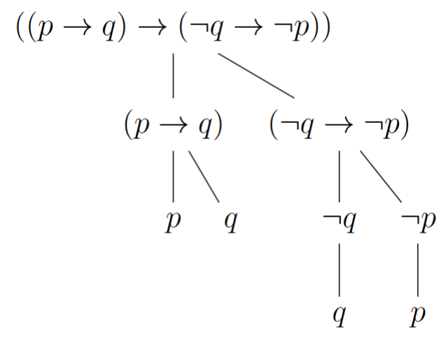

离散数学与结构 (2025Fall) 逻辑部分的笔记 (第一部分)。

## 基本定义

先引进一下 **命题逻辑(Proposition Logic)** 的字母表(Alphabet)：

**定义** 以下是命题逻辑的字母表 $\Sigma$：
    
- **命题符号** $P, Q, P_1, P_2, \bot$
- **连接词** $\rightarrow, \leftrightarrow, \land, \vee, \lnot, \bot$（注：$\bot$ 可以作为一个 $0$ 元连接词处理，也可以作为一个特殊的命题）
- 辅助符号 $()$

我们实际上处理的是由这些字母所构成的字符串．我们可以引入 
$$
\Sigma^* = \Sigma^0 \cup \Sigma^1 \cup \dots
$$ 
来表示所有有限长度的字符串所构成的集合，等号右边自然表示所有长度为 $0, 1, \dots$ 的字符串．但是这个集合实在是太大了，我们一般只处理其中的“合法”命题 PROP：

**定义** $\textup{PROP} \subseteq \Sigma^*$ 被定义为满足下列性质的最小集合：

1. 任意的原子命题 $P_i, \bot \in \textup{PROP}$；
2. 如果 $\phi, \psi \in \textup{PROP}$，则 $(\phi \rightarrow \psi), (\phi \leftrightarrow \psi), (\phi \land \psi), (\phi \vee \psi) \in \textup{PROP}$；
3. 如果 $\phi \in \textup{PROP}$，$\lnot \phi \in \textup{PROP}$．

**引理** 设 $A$ 是 $\Sigma^*$ 上的某个性质，如果：

1. 对任意的原子命题有 $A(p), A(\bot)$；
2. 若 $\phi, \psi \in \Sigma^*$ 满足 $A(\phi), A(\psi)$，那么对于二元连接词 $\square \in \{\rightarrow, \leftrightarrow, \land, \vee\}$，有 $A(\phi \square \psi)$；
3. 若 $\phi \in \Sigma^*$ 满足 $A(\phi)$，那么 $A(\lnot \phi)$；

则对任意的 $\phi \in \textup{PROP}$，有 $A(\phi)$．

**证明** 令 $\textup{PROP'} = \{\phi \in \textup{PROP} | A(\phi)\}$．不难验证 PROP' 满足 PROP 定义中的所有要求且 PROP' $\subseteq$ PROP，根据 PROP 的最小性可知 PROP' $=$ PROP．

有了这个引理，我们可以证明一些简单的事情，比如：对于所有合法命题，左括号的数目=右括号的数目=二元连接词的数目．从而 $(P\rightarrow Q)$ 是一个合法命题，而 $P \rightarrow Q$ 不是．

下一步，我们可以定义合法字符串上的函数．我们声称，只要有了下面的要素就可以唯一定义一个函数 $F: \textup{PROP} \rightarrow \Omega$ ($\Omega$ 是某个值域) ：

1. 在原子命题上存在函数 $H_{\textup{atomic}}: \{P_1, P_2, \dots, \bot\} \rightarrow \Omega$；
2. 在二元连接词上存在函数 $H_\square: \Omega \times \Omega \rightarrow \Omega$；
3. 存在函数 $H_\lnot: \Omega \rightarrow \Omega$．

具体的定义方式是，令 $F(P_i) = H_{\textup{atomic}}(P_i), F(\bot) = H_{\textup{atomic}}(\bot)$，然后 $F((\phi \square \psi)) = H_\square(F(\phi), F(\psi))$，以及 $F(\lnot \phi) = H_\lnot(F(\phi))$．这里看上去比较显然，但如何严格解释这一点呢？我们考虑对任何字符串作如下的分解：



为了说明函数可以被唯一定义，只需要说明任何合法字符串总能唯一地被分解；换言之，我们需要每一次作分解时能够选定被分解的连接词．这件事情在我们的定义下是容易的：如果字符串以 $\lnot$ 开头，选它即可；如果字符串以 $($ 开头，由于每一个连接词都对应到不同的括号层数，我们选择唯一的括号层数为 $1$ 的连接词即可．

下面我们来定义一种特殊的函数，称为命题的**赋值(Valuation)**：

**定义** 函数 $v: \textup{PROP} \to \{0, 1\}$ 被称为赋值当且仅当它满足下列性质：

- $v((\phi \land \psi)) = \textup{min}(v(\phi), v(\psi))$
- $v((\phi \vee \psi)) = \textup{max}(v(\phi), v(\psi))$
- $v((\phi \rightarrow \psi)) = 1 - v(\phi)(1 - v(\psi))$
- $v((\phi \leftrightarrow \psi)) = 1 - v(\phi)(1 - v(\psi)) - v(\psi)(1 - v(\phi))$
- $v(\lnot \phi) = 1 - v(\phi)$
- $v(\bot) = 0$

容易看出，函数 $v$ 就是我们对于命题的直观理解．根据之前对于函数的解释，只需要把 $H_\text{atomic}$ 等函数按照符合直观的方式定义即可．我们常用记号 $\llbracket \phi \rrbracket_v := v(\phi)$ 表示命题 $\phi$ 在 $v$ 下的值，接下来引入一些表示命题真假的记号：

**定义** 以“$\vDash \phi$” 表示 $\llbracket \phi \rrbracket_v = 1$ 对于所有的赋值 $v$ 成立．以“$\Gamma \vDash \phi$” 表示对于所有的赋值 $v$，如果对于任意的 $\psi \in \Gamma$ 都有 $\llbracket \psi \rrbracket_v = 1$，则 $\llbracket \phi \rrbracket_v = 1$．

从上面可以看出，逻辑分为 **语法(Syntax)** 和 **语义(Semantic)** 两个层面．语法只是将命题视为字符串进行若干操作，而语义层面可以考虑的事情就比较多，例如上面所讨论的命题的“真假”．

在语义层面上，我们还可以讨论命题的“替换”．以记号 $\phi[\psi/P]$ 表示把字符串 $\phi$ 中的 $P$ 替换为 $\psi$ 的结果，那么有若 $\vDash \phi$ 则 $\vDash \phi[\psi/P]$．何以见得？这相当于将原本的赋值 $v$ 换为 $v'$，后者在原子命题上的定义为 $v'(P_i) = \begin{cases}
     v(P_i) \text{ ，若 } P_i \neq P  \\
     v(\psi) \text{ ，若 } P_i = P
\end{cases}$．

另一个好用的记号是 $\phi \approx \psi$，表示 $\phi \vDash \psi$ 且 $\psi \vDash \phi$．一些基本的性质包括：

- $(\phi \land \psi) \approx (\psi \land \phi)$
- $((\phi \land \psi) \land \delta) \approx (\phi \land (\psi \land \delta))$
- $((\phi \land \psi) \vee \delta) \approx ((\phi \land \delta) \vee (\psi \land \delta))$
- $\lnot \lnot \phi \approx \phi$

## 自然演绎，System K

我们希望我们能够通过一些比较机械的方式去形式化地证明命题，而不仅仅是向之前的内容那样使用自然语言来论述，所以我们需要回到语法的层面．先来介绍所谓的**自然演绎(Natural Deduction)**．

**定义** 以下是若干的推导规则，横线上方为条件，下方为结论，右侧为这条规则的名称，[ ]表示假设：
    
$$
\dfrac{\phi \land \psi}{\phi} (\land\text{E}) \quad\quad \dfrac{\phi \land \psi}{\psi} (\land\text{E}) \quad\quad \dfrac{\phi \quad \psi}{\phi \land \psi} (\land\text{I})
$$

$$
\dfrac{\begin{matrix} [\phi] \\ \vdots \\ \psi \end{matrix}}{\phi \rightarrow \psi} (\rightarrow\text{I}) \quad\quad \dfrac{\phi \quad \phi \rightarrow \psi}{\psi} (\rightarrow\text{E}) \quad\quad \dfrac{\bot}{\phi} (\bot)
$$

$$
\dfrac{\begin{matrix} \lnot \phi \\ \vdots \\ \bot \end{matrix}}{\phi} (\text{RAA})
$$

注意，这里的演绎规则是一种简化的版本，容易发现这里面并没有出现连接词 $\leftrightarrow$，$\vee$ 和 $\bot$．在这里，我们将它们当作一些简写来处理：$\phi \leftrightarrow \psi$ 作为 $\phi \rightarrow \psi \land \psi \rightarrow \phi$ 的简写，$\phi \vee \psi$ 作为 $\lnot ((\lnot \phi) \land (\lnot \psi))$ 的简写，$\lnot \phi$ 作为 $\phi \rightarrow \bot$ 的简写． 

相应于 $\vDash$，这里也有对应的记号：

**定义** 以 $\vdash \phi$ 表示 $\phi$ 能够经由以上规则推导，以 $\Gamma \vdash \phi$ 表示 $\phi$ 能够通过 $\Gamma$ 经由以上规则推导． 

下面来举几个例子．（由于 markdown 没法用 `prooftree` 环境，只好用 `\dfrac` 模拟了）

第一个例子是证明 $\vdash \lnot \lnot p \rightarrow p$：

$$
\dfrac{
    \dfrac{
        \dfrac{
            [(p \rightarrow \bot) \rightarrow \bot]^1 \quad [p \rightarrow \bot]^2
        }{\bot} (\rightarrow\text{E})
    }{p} (\text{RAA}_2)
}{((p \rightarrow \bot) \rightarrow \bot) \rightarrow p} (\rightarrow\text{I}_1)
$$

第二个例子是证明 $\vdash p \rightarrow \lnot \lnot p$：

$$
\dfrac{
    \dfrac{
        \dfrac{
            [p \rightarrow \bot]^1 \quad [p]^2
        }{\bot} (\rightarrow\text{E})
    }{(p \rightarrow \bot) \rightarrow \bot} (\rightarrow\text{I}_1)
}{p \rightarrow ((p \rightarrow \bot) \rightarrow \bot)} (\rightarrow\text{I}_2)
$$

下一组例子是证明 $\vdash (p \rightarrow q) \rightarrow (\lnot q \rightarrow \lnot p)$： 

$$
\dfrac{
    \dfrac{
        \dfrac{
            \dfrac{
                [\lnot q]^2 \quad
                \dfrac{
                    [p \rightarrow q]^1 \quad [p]^3
                }{q} (\rightarrow\text{E})
            }{\bot} (\rightarrow\text{E})
        }{\lnot p} (\rightarrow\text{I}_3)
    }{\lnot q \rightarrow \lnot p} (\rightarrow\text{I}_2)
}{(p \rightarrow q) \rightarrow (\lnot q \rightarrow \lnot p)} (\rightarrow\text{I}_1)
$$

和 $\vdash (\lnot q \rightarrow \lnot p) \rightarrow (p \rightarrow q)$：

$$
\dfrac{
    \dfrac{
        \dfrac{
            \dfrac{
                \dfrac{
                    [\lnot q \rightarrow \lnot p]^1 \quad [\lnot q]^3
                }{\lnot p} (\rightarrow\text{E})
                \quad [p]^2
            }{\bot} (\rightarrow\text{E})
        }{q} (\text{RAA}_3)
    }{p \rightarrow q} (\rightarrow\text{I}_2)
}{(\lnot q \rightarrow \lnot p) \rightarrow (p \rightarrow q)} (\rightarrow\text{I}_1)
$$

留意到虽然这两组命题很相似，但是它们之中一个需要 RAA，一个不需要．之后我们会更仔细地讨论这个问题．回忆我们最初的目标是将证明在一定程度上机械化，但是这里有一点不太完美的地方，例如 $\rightarrow$I 规则中间涉及了省略的推导，换言之它以一定的推导作为前置．这可能带来“不那么机械化”或者证明树太大的问题，因而我们可能有时并不想要这样的规则，**System K** 就是一种解决办法：

**定义** System K 使用这样的语义：用 $\phi_1, \phi_2, \dots \Rightarrow \psi_1, \psi_2, \dots$ 代表“当左边命题均成立时，右边的命题至少有一个成立”，命题无所谓顺序．用 $\Gamma$ 和 $\Delta$ 表示若干命题，那么它的语法规则如下：

$$
\dfrac{\Gamma \Rightarrow \Delta, \phi}{\lnot \phi, \Gamma \Rightarrow \Delta} \quad\quad \dfrac{\phi, \Gamma \Rightarrow \Delta}{\Gamma \Rightarrow \Delta, \lnot \phi}
$$

$$
\dfrac{\phi, \psi, \Gamma \Rightarrow \Delta}{\phi \land \psi, \Gamma \Rightarrow \Delta} \quad\quad \dfrac{\Gamma \Rightarrow \Delta, \phi \quad \Gamma \Rightarrow \Delta, \psi}{\Gamma \Rightarrow \Delta, \phi \land \psi}
$$

$$
\dfrac{\Gamma \Rightarrow \Delta, \phi, \psi}{\Gamma \Rightarrow \Delta, \phi \vee \psi} \quad\quad \dfrac{\phi, \Gamma \Rightarrow \Delta \quad \psi, \Gamma \Rightarrow \Delta}{\phi \vee \psi, \Gamma \Rightarrow \Delta}
$$

$$
\dfrac{\phi, \Gamma \Rightarrow \Delta, \psi}{\Gamma \Rightarrow \Delta, \phi \rightarrow \psi} \quad\quad \dfrac{\Gamma \Rightarrow \Delta, \phi \quad \psi, \Gamma \Rightarrow \Delta}{\phi \rightarrow \psi, \Gamma \Rightarrow \Delta}
$$

以及一条公理：若 $\Delta \subseteq \Gamma$，则 $\Gamma \Rightarrow \Delta$．

抽象地说，$\Gamma$ 和 $\Delta$ 在某种意义上存储了之前的证明过程．System K 可以给出非常机械化的证明，由于它的推导规则只能做到添加符号而不能减少符号，System K 一定能在有限步内给出某个命题的证明，或者说明该命题不可证明．

## 命题逻辑的完备性

**定义** 定义如下的性质：
- **一致性(Soundness)** 若 $\Gamma\vdash\phi$，则 $\Gamma\vDash\phi$；
- **完备性(Completeness)** 若 $\Gamma\vDash\phi$，则 $\Gamma\vdash\phi$．

本节的目标是证明下面的结论：

**定理** 自然演绎是一致、完备的．

一致性的证明略无聊，此处省去，仅证完备性．我们需要下面的简单引理，常被称为“排中律”：

**引理** 如果$\begin{cases} \Gamma,\psi\vdash\phi \\ \Gamma,\lnot\psi\vdash\phi \end{cases}$，那么 $\Gamma\vdash\phi$．

**证明** 直接进行推导：

$$
\dfrac{
    \dfrac{
        \begin{matrix}
        \dfrac{
            \dfrac{
                \begin{matrix} [\psi]^1 \\ \vdots \\ \phi \end{matrix} \quad [\lnot\phi]^2
            }{\bot} (\rightarrow E)
        }{\lnot\psi} (\rightarrow I_1) \\
        \vdots \\
        \phi
        \end{matrix}
    }{\bot} (\rightarrow E)
}{\phi} (\text{RAA}_2)
$$

反复使用上面的引理，为了证明 $\Gamma\vdash\phi$，只需说明所有的 $\begin{cases} \Gamma,p_1,p_2,\dots,p_n\vdash\phi \\ \Gamma,p_1,\lnot p_2,\dots,p_n\vdash\phi \\ \Gamma,\lnot p_1,p_2,\dots,p_n\vdash\phi \\ \Gamma,\lnot p_1,\lnot p_2,\dots,p_n\vdash\phi \\ \dots \end{cases}$ 为真．将 $p_1,p_2,\dots,p_n =: V$ 取作 $\Gamma\cup\{\phi\}$ 中全部的原子命题，则“ $p_1,p_2,\dots,p_n$ 为真”定义了一个唯一的赋值 $v$，如果 $\Gamma$ 在 $v$ 下为假，也即存在 $\psi\in\Gamma$ 使得 $\llbracket \psi \rrbracket_v=0$，则自然有 $\Gamma,V\vdash\phi$ 成立：

$$
\dfrac{
    \dfrac{
        \begin{matrix} V \\ \vdots \\ \lnot \psi \end{matrix} \quad \psi\in\Gamma
    }{\bot} (\rightarrow E)
}{\phi} (\bot)
$$

如果 $\Gamma$ 为真，则由 $\Gamma\vDash\phi$ 知 $\llbracket \phi \rrbracket_v=1$，问题就归结于下面的引理：

**引理** 令 $p_1,p_2,\dots,p_n$ 为 $\Gamma\cup\{\phi\}$ 中的全部原子命题，$v$ 是一个赋值，令 $V=\begin{cases} p_i \text{ , 若 }\llbracket p_i \rrbracket_v=1 \\ \lnot p_i \text{ , 若 }\llbracket p_i \rrbracket_v=0 \end{cases}$．那么：
如果 $\llbracket \phi \rrbracket_v=1$，则 $V\vdash\phi$；
如果 $\llbracket \phi \rrbracket_v=0$，则 $V\vdash\lnot\phi$．

**证明** 证明的想法是对 $\phi$ 归纳，将问题化归到最简单的原子命题上．引理的最后半句话与前面的证明无直接关系，主要是为了归纳的方便．
    
情形I. $\phi$ 是一个原子命题，则 $\phi$ 可能是命题 $p_i$，也可能是 $\bot$．
    
如果 $\phi=p_i$ 且 $\llbracket p_i \rrbracket_v=1$，那么 $p_i\in V$，进而 $V\vdash p_i$；若 $\llbracket p_i \rrbracket_v=0$，那么 $\lnot p_i\in V$，进而 $V\vdash\lnot p_i$．
    
如果 $\phi=\bot$，$\llbracket \bot \rrbracket_v=0$，$\lnot\bot$ 恒成立，自然有 $V\vdash\lnot\bot$．
    
情形II. 如果 $\phi=\psi_1\rightarrow\psi_2$，也有两种情况．
    
若 $\llbracket \phi \rrbracket_v=1$，有 $\llbracket \psi_1 \rrbracket_v=0$ 或 $\llbracket \psi_2 \rrbracket_v=1$．由归纳假设可知，$V\vdash\lnot\psi_1$ 或 $V\vdash\psi_2$．由于：

$$
\dfrac{
    \dfrac{
        \dfrac{
            \begin{matrix} \vdots \\ \lnot\psi_1 \end{matrix} \quad [\psi_1]
        }{\bot} (\rightarrow E)
    }{\psi_2} (\bot)
}{\psi_1\rightarrow\psi_2} (\rightarrow I)
$$

以及：

$$
\dfrac{
    \begin{matrix} \vdots \\ \psi_2 \end{matrix} \quad [\psi_1]
}{\psi_1\rightarrow\psi_2} (\rightarrow I)
$$

我们知道总有 $V\vdash\phi$ 成立．
    
若 $\llbracket \phi \rrbracket_v=0$，有 $\llbracket \psi_1 \rrbracket_v=1$ 且 $\llbracket \psi_2 \rrbracket_v=0$．由归纳假设可知，$V\vdash\psi_1$ 且 $V\vdash\lnot\psi_2$．由于：

$$
\dfrac{
    \dfrac{
        \dfrac{
            \begin{matrix} \vdots \\ \psi_1 \end{matrix} \quad [\psi_1\rightarrow\psi_2]
        }{\psi_2} (\rightarrow E)
        \quad
        \begin{matrix} \vdots \\ \lnot\psi_2 \end{matrix}
    }{\bot} (\rightarrow E)
}{\lnot(\psi_1\rightarrow\psi_2)} (\rightarrow I)
$$

因此 $V\vdash\lnot\phi$．归纳到此结束！

## 直觉主义，Kripke Model

将 RAA 从自然演绎的规则中删去，就得到了 **直觉主义(Intuitionism)** 逻辑．引入记号 $\vdash_i$ 表示以直觉主义逻辑推导．我们知道，在自然演绎中，$\lnot\lnot p\rightarrow p$ 和 $(\lnot q \rightarrow \lnot p)\rightarrow(p\rightarrow q)$ 这样的命题是“需要” RAA 进行推导的，问题在于如何严格证明在删去了 RAA 的直觉主义逻辑中它们不可推导．为此，我们需要引入一种新的语义：

**定义** 以下语义被称为 **Kripke Model**：
    
给定偏序集 $(W,\le)$，元素 $w\in W$ 被称为“世界”．赋值 $v: W \times \text{Atomic Prop} \rightarrow \{0,1\}$ 需要满足以下性质：若 $w_1\ge w_2$，那么 $v(w_1,p_i)\ge v(w_2,p_i)$；对任意 $w\in W$，$v(w, \bot)=0$．
    
定义 $v(w,\psi\rightarrow\phi)=\begin{cases} 1 \text{，如果 } 
     v(w',\phi)\ge v(w',\psi)\text{ 对任意 } w'\ge w\text{ 成立；} \\ 0 \text{，otherwise．}\end{cases}$ 
     
若对于任意 $W,v$，任意 $w\in W$，都有 $v(w,\phi)=1$，那就记 $\vDash_i\phi$．

可以证明：直觉主义逻辑在 Kripke Model 语义下是一致完备的．因此，通过构造适当的 Kripke Model 使得一个命题在某个世界中为假，就可以说明直觉主义逻辑无法推导该命题（这一点实际上只需要一致性即可）例如，我们可以构造 $w_1 \le w_2$: 

$$
\boxed{
\begin{array}{l}
    v(\bot)=0 \\
    v(p)=0 \\
    v(\lnot p)=0 \\
    v(\lnot \lnot p)=1
\end{array}
}
\quad \le \quad
\boxed{
\begin{array}{l}
    v(\bot)=0 \\
    v(p)=1 \\
    v(\lnot p)=0 \\
    v(\lnot \lnot p)=1
\end{array}
}
$$

观察到 $\lnot\lnot p\rightarrow p$ 在 $w_1$ 中不真，但在 $w_2$ 中真．这个例子还能说明 $(((p\rightarrow q)\rightarrow p)\rightarrow p)$ 也在直觉主义逻辑中失效．

值得一提的是，直觉主义逻辑和机器证明有很大的联系．我们可以证明直觉主义逻辑在下面这种语义下一致完备：命题 $p\rightarrow q$ 为真，代表着对于“类型” $P$ 和 $Q$，存在函数 $f:P\rightarrow Q$，使得 $f$ 对 $P$ 的一个实例 $p$ 给出 $Q$ 的实例 $q$．下面是一些例子：

1. 推导 $p \rightarrow \lnot\lnot p$：
```python
    def f(p):
        return lambda g : g(p)
        # g: P -> bot
    # 函数f接受P的实例，返回一个lambda；该lambda接受P->bot的实例，返回bot（即g(p)）
    # 因而f作用在P的实例上给出(p->bot)->bot的实例，从而证明了p->notnotp
```

2. 推导 $(p\rightarrow q)\rightarrow(\lnot q\rightarrow\lnot p)$：
```python
    def f(h):
        return lambda g : g ◦ h
        # h: p -> q  g: q -> bot
    # f接受p->q的参数h，返回一个lambda；
    # 该lambda在接受h=q->bot时，返回函数p->bot
    # 从而f作用在p->q上返回(not q)->(not p)
```

$\bot$ 能推导任何命题，原因是它相当于一个接受 $0$ 个参数的函数．$P \land Q$ 可以表达为 C 语言的 `pair<P, Q>`；$P\vee Q$ 则相当于 `union\{P; Q;\}`．下面是推导 $((p\rightarrow q)\land(q\rightarrow s)\rightarrow(p\vee q \rightarrow s)$ 的例子：
```python
    def f(pair):
        u, v = pair
        def g(x):
            case x:P : return u(x)
            case x:Q : return v(x)
        return g
```