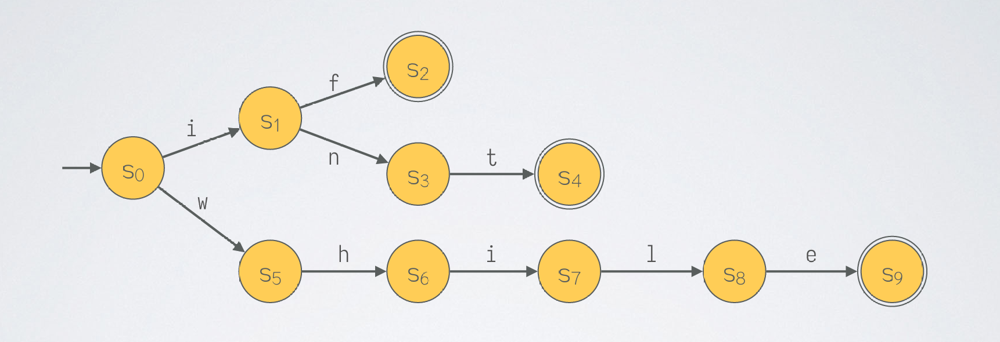
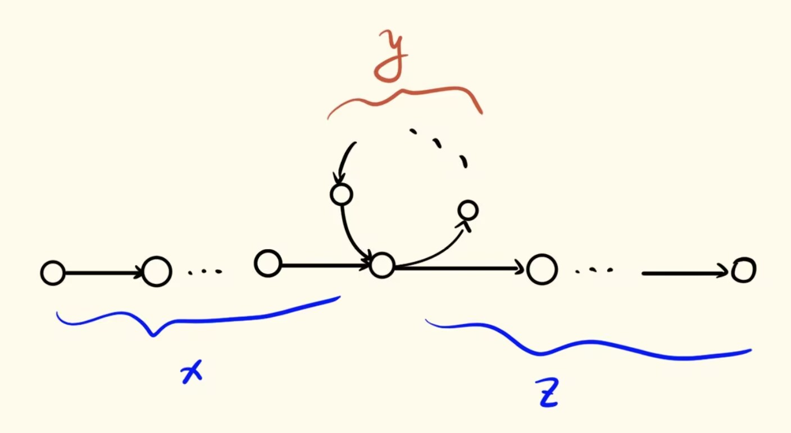

理论计算机科学基础（2026Fall）个人笔记。

## 前言

一些前置知识懒得详细写了，总之：
- 我们有字母表 $\Sigma$，字母表上有字符串，字符串可以连接，连接运算的单位元是空串 $\varepsilon$，串长度用 $|s|$ 表示。子串顾名思义，子序列相当于不要求连续的子串。
- 字符串的集合叫做语言，特别地 $\Sigma^*$ 表示 $\Sigma$ 上所有有限长的串，$\Sigma^+$ 是在前者中去掉空串，$\Sigma^\infty$ 表示无穷长的。$\varnothing$ 是空语言。字符串的连接运算可以扩展到语言上，即 $AB = \{xy \mid x \in A, y \in B\}$，类似笛卡尔积。语言上可以定义序，最常见的是字典序，然而字典序并非良序；标准序是先比串长度，串长度相等时再按照字典序，这是一个良序。

下面介绍本文的主要知识。正则语言是一类性质较好的语言，它有三种方式去描述，分别是确定性有限自动机 DFA、非确定性有限自动机 NFA 和正则表达式 REX，最终我们会证明这三种描述方式等价。正则语言的较重要的性质包括：
1. 封闭性，正则语言的交、并、补、连接、星号仍然是正则语言；
2. 必要条件，即泵引理；
3. 充分必要条件，即 Myhill-Nerode 引理，该引理还可以刻画最小 DFA 的概念。

为什么有充要条件依然要介绍较弱的泵引理呢？主要是因为之后要学习的上下文无关语言给不出 Myhill-Nerode 引理这样好用的充要判据，所以提前熟悉一下（？）

下文从 DFA 开始逐个介绍。

## DFA

**DFA** 是对状态转移图的一种形式化描述。所谓的状态转移图，比如：

包括若干状态（以圆圈表示），状态中含有一个初始状态（图中的 $s_0$，标记有一条初始边）和若干接受状态（比如 $s_2$ 等，标记为双层圆圈）。每条边上写着一个字符，表示从该状态读取一个字符后转移到下一个状态。（注：该图的 DFA 有部分转移边未画全。）

严格来说，DFA 是一个五元组 $M = (Q, \Sigma, \delta, q_0, F)$，其中 $Q$ 是有限状态集，$\Sigma$ 是字母表，$\delta: Q \times \Sigma \to Q$ 是转移函数，$q_0 \in Q$ 为初始状态，$F \subseteq Q$ 为接受状态集合。

给定串 $w = w_1\dots w_n$，得到状态转移序列：$r_0, r_1, \dots, r_n$，其中 $r_0 = q_0, r_{i} = \delta(r_{i-1}, w_i)$。如果 $r_n \in F$，就称该 DFA 接受 $w$。这就是 DFA 所描述的计算过程。可以被自动机 M 接受的所有字符串记作 $L(M)$。如果一个语言可以被一个 DFA 接受，我们就说这个语言是**正则语言**。 

状态转移函数 $\delta$ 可以引申为扩展转移函数 $\hat\delta: Q \times \Sigma^* \to Q$，允许接受字符串进行多步转移。

给定一个语言 $L \subseteq \Sigma^*$，定义两个串 $x, y$ 不可区分 $x \sim_L y$ 当且仅当 $\forall z \in \Sigma, xz \in L \leftrightarrow yz \in L$。容易验证不可区分关系是 $\Sigma^*$ 上的等价关系，因此它将 $\Sigma^*$ 划分成若干等价类。直觉上，每个等价类就类似于 DFA 的一个状态，事实上也确实如此：

**定理（Myhill-Nerode 引理）** $L \subseteq \Sigma^*$ 是正则语言当且仅当 $|\Sigma^*/\sim_L| < +\infty$。

**证明** 分两个方向。
- 必要性，如果 $L$ 正则，设 DFA $M = (Q, \Sigma, \delta, q_0, F)$ 识别 $L$。定义 $x \sim_M y$ 当且仅当 $q_x = q_y$，即 $x$ 和 $y$ 在该 DFA 中到达相同的状态，可以检验这也是等价关系。那么 $x \sim_M y \Rightarrow x \sim_L y$：既然 $x$ 和 $y$ 到达状态相同，那么 $xz$ 和 $yz$ 也相同，它们要么都能被接受，要么都不能。因此 $|\Sigma^*/\sim_L| \le |\Sigma^*/\sim_M| \le |Q| < +\infty$.
- 充分性，如果等价类数目有限，我们以等价类作为状态就可以构造 DFA。严格来说，用 $[x]$ 表示 $x$ 所在的等价类，令 $Q = \Sigma^* / \sim_L$，$q_0 = [\varepsilon]$，$F = \{[x] \mid x \in L\}$，$\delta([x], z) = [xz]$ 即可，从 $\sim_L$ 的定义出发可以检验上面是良定义的。 

特别地，上面的证明同时说明，
- 如果 $L$ 能被 DFA 识别，那么 DFA 的状态数 $\ge |\Sigma^*/\sim_L|$；
- 如果 $L$ 是正则语言，那么它可以被一个有 $|\Sigma^*/\sim_L|$ 个状态的 DFA 识别。
因此这也给出了**最小 DFA** 的概念。先定义串可区分：$\exists z \in \Sigma^*, xz \in L \leftrightarrow yz \notin L$。可以拓展为状态可区分：$\exists a, \hat\delta(p, a) \in F \leftrightarrow \hat\delta(q, a) \notin F$。由此可以给出从某个 DFA 构造最小 DFA 的算法：
1. 删除从 $q_0$ 不可达的状态。
2. 将 $Q$ 分成 $F$ 和 $Q \backslash F$ 两类。
3. 对每个分好的状态集，两两检查其中的状态 $p$，$q$，如果 $\exists a \in \Sigma$，$\delta(p, a)$ 和 $\delta(q, a)$ 落入了不同的状态集，就将该状态集切分。重复此过程直至不再产生新的切分为止。

## NFA

**NFA** 允许转移的“不确定性”，允许一个状态通过一个字母转移到多个状态，也允许 $\varepsilon$ 空转移。具体来说，NFA 也是五元组 $N = (Q, \Sigma, \delta, q_0, F)$，这里 $\Sigma_\varepsilon = \Sigma \cup \{\varepsilon\}$，$\delta: Q \times \Sigma_\varepsilon \to P(Q)$，$q_0 \in Q$，$F \subseteq Q$。NFA 的计算是树形的，因为每次转移有多种可能的结果。与 DFA 不同，在读完输入串 $w$ 后只要有一种计算路径可以到达接受状态就称之为接受。

DFA 是特殊的 NFA，所以 NFA 的表达能力至少不弱于 DFA。事实上可以证明，

**定理** DFA 和 NFA 表达能力相同。

**证明** 接上文，只需要证明能被 NFA 识别的语言也能被 DFA 识别即可。假设语言 $L \subseteq \Sigma^*$ 被 NFA $N = (Q_1, \Sigma, \delta, q_0, F)$ 识别，我们使用如下算法（称为幂集构造法）来构造 DFA $D = (Q_2, \Sigma, \delta', q_0', F')$：
1. 初始状态：$q_0' = E(\{q_0\})$，这里 $E(P) = \{Q \mid 从 p \in P 能通过0次或多次 \varepsilon 转移到达 Q\}$ 称为 $\varepsilon$ 闭包。
2. 给定构造好的状态集 $Q$ 和字母 $a$，计算 $Q$ 中所有状态通过 $a$ 可能转移到的状态，然后再取 $\varepsilon$ 闭包。即 $\delta'(Q, a) = E(\{p \mid \exists r \in Q, p \in \delta(r, a)\}) = E\left(\bigcup_{r\in Q}\delta(r, a)\right)$。
3. 接受状态：只要里面含有原接受状态即可，即 $F' = \{Q \mid Q \cap F \neq \varnothing\}$。

有了 NFA 之后，我们可以很方便地证明正则语言的性质。

**定理** 正则语言对交、并、补、连接、星号、字符串反转运算封闭。

**证明** 都是构造相应的 DFA / NFA。
1. 并：有两种证明方式。第一种是使用 NFA，只需要新增一个初始结点，然后通过 $\varepsilon$ 转移到达两个旧 DFA / NFA 的原初始结点即可。第二种是使用 DFA，借助笛卡尔积设计新的自动机 $(Q_A \times Q_B, \Sigma, \delta_{A\cup B}, (q_{0A}, q_{0B}), (Q_A \times F_B) \cup (F_A \times Q_B))$，也就是说，其状态为 $(q_A, q_B)$，两者分别按原 DFA 的方式转移，只要有一个接受即接受。
2. 交：构造和并类似的 DFA，但是 $F = F_A \times F_B$，即两个分量都接受才视为接受。
3. 补：把原 DFA 的接受状态和非接受状态翻转即可。
4. 连接：新 DFA 的初始状态为第一个 DFA 的初始状态，接受状态为第二个 DFA 的接受状态；第一个 DFA 的接受状态通过 $\varepsilon$ 转移到达第二个 DFA 的初始状态。
5. 星号：新增一个初始状态，同时将其设为接受状态，该结点通过 $\varepsilon$ 转移到达原先的初始状态；然后让原接受状态通过 $\varepsilon$ 转移回到新增的初始状态。
6. 字符串反转：让原 DFA 倒着跑，新增初始状态，通过 $\varepsilon$ 转移到达所有的原接受状态，把原初始状态变成唯一接受状态。

## 正则表达式

正则表达式是归纳地定义的：

1. $a$，$\varepsilon$，$\varnothing$ 是正则表达式，且 $L(a) = \{a\}$，$L(\varepsilon) = \{\varepsilon\}$，$L(\varnothing) = \varnothing$。
2. 如果 $R_1, R_2$ 是正则表达式，那 $R_1R_2$ 也是，$L(R_1R_2) = L(R_1) L(R_2)$。
3. 如果 $R_1, R_2$ 是正则表达式，那 $R_1 \cup R_2$ 也是，$L(R_1 \cup R_2) = L(R_1)\cup L(R_2)$。
4. 如果 $R_1$ 是正则表达式，那 $R_1^*$ 也是，$L(R_1^*) = L(R_1)^*$。

下面来说明：

**定理** 正则表达式的表达能力与 DFA / NFA 相同。

**证明** 首先，正则表达式的每一条规则都容易构造相应的 DFA 或 NFA，因此正则表达式的表达能力不超过 DFA 和 NFA。主要是说明 DFA 一定能转化成正则表达式。引入 GNFA，允许状态转移图的边上标记正则表达式而非单个字母。我们给出如下算法：

1. 给定 DFA，引入新初始状态，通过 $\varepsilon$ 转移到达原初始状态；引入新接受状态，让所有接受状态通过 $\varepsilon$ 转移到达它。
2. 对于某个状态 $q_{rip}$，假设有状态 $i$ 通过 $\alpha_i$ 转移到它，它通过 $\beta_j$ 转移到 $j$，它自己可以通过 $\gamma$ 转移到自己。删除 $q_{rip}$，对于每一对 $i$，$j$，把它们边上的标记修改为 $r_{ij} \cup \alpha_i \gamma^* \beta_j$，这里 $r_{ij}$ 为边上原有的正则表达式（若原来没有边则视为 $\varnothing$）。
3. 最终只剩下新增的初始状态、接受状态和它们之间的一条边，那条边上的正则表达式的语言与原 DFA 相同。

最后，我们给出判定语言非正则的另一个引理：

**定理（泵引理）** 如果 $L$ 是正则语言，那么存在泵长度 $p$，$\forall s \in L$, 在 $|s| \ge p$ 时, $\exists x,y,z,s = xyz$，且 $|xy| \le p$, $|y| > 0$, $xy^iz \in L$, $i \in \mathbb{N}$。

证明思路比较直接：假设 DFA 识别 $L$，将泵长度取为状态数 $|Q|$，如果 $s$ 的长度比 DFA 的状态数还要大，那么它在 DFA 中经过的路径必然有环：

例子：$\{0^n1^n \mid n \in \mathbb{N}\}$ 不正则。

注意泵引理仅能用于判断语言不是正则语言，因为它只是必要条件。此外，泵引理能导出某种等差数列，如果一个语言的串长度间隔直觉上是越来越大的（比如说 $\{0^{2^k} \mid k \ge 0\}$，甚至是 $\{0^p \mid p 是素数\}$），那它也不正则。