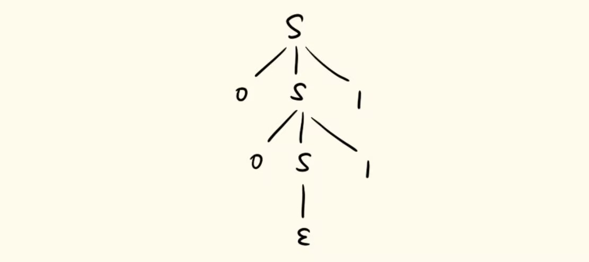
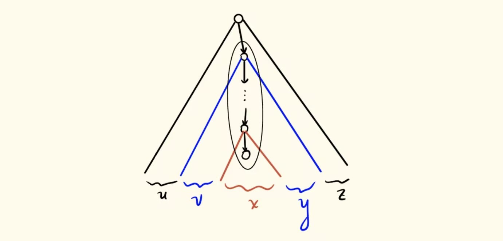
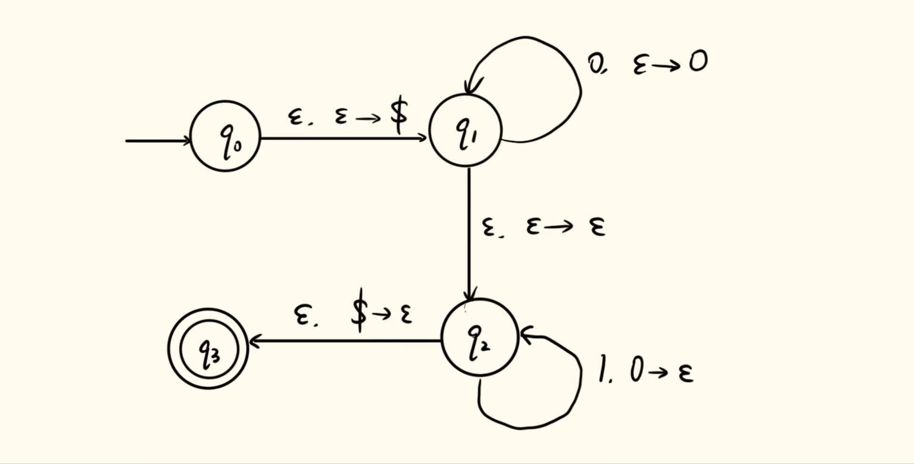
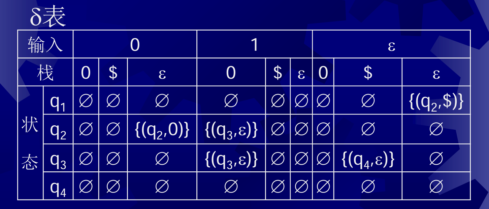
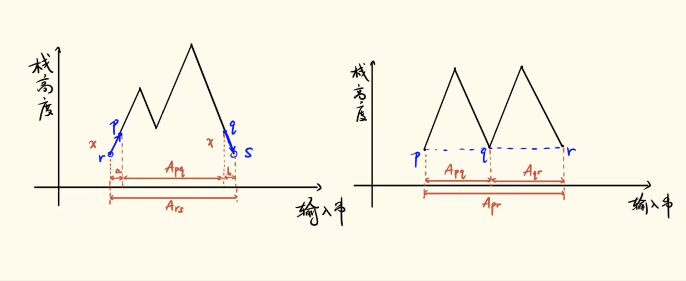

理论计算机科学基础（2026Fall）个人笔记。

## 前言

我们使用上下文无关文法（**C**ontext-**F**ree **G**rammar）来描述上下文无关语言（**C**ontext-**F**ree **L**anguage），而 CFG 有一种标准写法称为乔姆斯基范式（**C**homsky **N**ormal **F**orm）。上下文无关语言的性质不如正则语言好，它对连接、并、星号封闭，对补、交则不封闭，泵引理是判断上下文无关的必要条件。上下文无关语言对应的自动机叫做下推自动机（**P**ush**D**own **A**utomaton），因为这种语言实际上引入了堆栈。

## 上下文无关文法 CFG

**上下文无关文法**是一个四元组 $G = (V, \Sigma, R, S)$，其中 $V$ 为变元集或非终结符集，$\Sigma$ 为字母表或终结符集，$R$ 为规则集，$S \in V$ 为初始变元。其中，规则的形式为 $A \to w$，其中 $A \in V$，$w \in (V \cup \Sigma)^*$（形如 $uAv \to uwv$ 的是上下文有关文法）。文法是产生式的，比如之前被证明非正则的 $\{0^n1^n \mid n \in \mathbb{N}\}$，考虑 $G = (\{S\}, \{0, 1\}, \{S \to 0S1, S \to \varepsilon\}, S)$，引入**派生**记号 $\Rightarrow$，有
$$
S \Rightarrow \varepsilon \\
S \Rightarrow 0S1 \Rightarrow 01 \\
S \Rightarrow 0S1 \Rightarrow 00S11 \Rightarrow 0011
$$
多步派生可以用 $\Rightarrow^*$ 表示，即 $S \Rightarrow^* 0^n1^n$，$\forall n \in \mathbb{N}$。定义文法生成的语言 $L(G) = \{w \in \Sigma^* \mid S \Rightarrow^* w\}$，所有能够由上下文无关文法生成的语言称为**上下文无关语言**。左端相同的产生规则可以简写，比如 $S \to \varepsilon \mid 0S1$。派生过程可以表示为树结构，称为语法分析树，比如：

另一个例子：所有能配平的括号串，可以表示为 $G = (\{S\}, \{(, )\}, \{S \to \varepsilon \mid (S) \mid SS\}, S)$。考虑如下派生过程：
$$
S \Rightarrow SS \Rightarrow S(S) \Rightarrow S() \Rightarrow (S)() \Rightarrow ((S))() \Rightarrow (())() \\
S \Rightarrow SS \Rightarrow (S)S \Rightarrow ((S))S \Rightarrow (())S \Rightarrow (())(S) \Rightarrow (())()
$$
画语法分析树会发现，虽然派生过程不同，但是语法分析树是相同的。第二种派生方式每次展开最左侧的非终结符，称为**最左派生**。

在某些情况下，即使都使用最左派生也可能产生不同的语法分析树，这种情况称为**二义性**或**歧义性**，例如：$G_3 = (\{S\}, \{a, +, *\}, \{S \to S + S \mid S * S \mid a\}, S)$，
$$
S \Rightarrow S + S \Rightarrow a + S \Rightarrow a + S * S \Rightarrow a + a * S \Rightarrow a + a * a \\
S \Rightarrow S * S \Rightarrow S + S * S \Rightarrow a + S * S \Rightarrow a + a * S \Rightarrow a + a * a
$$
可以看出，语法分析树实质上蕴含着一些语义结构，这里的两种语义分别对应先算乘法和先算加法。我们可以通过一些方式消除歧义，例如：
$$
S \to S+E \mid E\\
E \to E*T \mid T\\
T \to (S) \mid a
$$
这个文法的优先级和日常相同：先括号，再乘法，最后再加法，不再有二义性。

下面可以来证明上下文无关语言的封闭性。设上下文无关语言 $A$ 的文法为 $G_1$，初始符号 $S_1$，上下文无关语言 $B$ 的文法为 $G_2$，初始符号 $S_2$，不妨设两个语言变元不重名。
1. $AB$ 仍是上下文无关语言，只需要引入初始符号 $S$ 和规则 $S \to S_1S_2$，并继承其他所有规则。
2. $A \cup B$ 仍是上下文无关语言，只需要引入初始符号 $S$ 和规则 $S \to S_1 \mid S_2$，并继承其他所有规则。
3. $A^*$ 仍是上下文无关语言，只需要引入初始符号 $S$ 和规则 $S \to \varepsilon \mid S_1S，并继承其他所有规则$。
4. $A^R$（字符串反转）仍是上下文无关语言，只需要把原规则的右侧全部反转。

在说明对交和补不封闭之前，我们先来阐述判定语言不是上下文无关语言的判据：

**定理（泵引理）** 设 $L$ 是上下文无关语言，则存在泵长度 $p$，使得 $\forall s \in L$，如果 $|s| \ge p$，则 $\exists u, v, x, y, z$，$s = uvxyz$ 且 $|vxy| \le p$，$|vy| > 0$，$uv^ixy^iz \in L$，$\forall i \in \mathbb{N}$。

证明思路也比较直观，考虑语法分析树（如下图），只要串足够长，语法分析树就足够高，那就必然存在足够长的路径，这条路径上就会有重复的变元。把父节点变元重复展开（图中把蓝色“子子树”反复替换为红色子树），就可以一直泵下去：

具体来说：
- 具体来说，令 $b = \max_{A\to w \in R} |w|$ 为产生式右侧最大长度，不妨设 $b \ge 2$。取 $p = b^{|V|+1}$，这样我们的语法分析树至多是 $b$ 叉树，且必然存在长度超过 $|V|$ 的、从根结点到叶结点的路径。
- 考察这条路径最靠近叶子的 $|V| + 1$ 个非终结符结点，其中必然有重复的变元。取这一组结点，那么上层结点距离路径末端不超过 $|V| + 1$，就能使得 $|vxy| \le b^{|V|+1} = p$。
- 事先在所有语法分析树中取结点数最小的语法分析树就能使得 $|vy| > 0$。如果 $|vy| = 0$，那么这两个重复变元之间都是 $\varepsilon$ 展开，删去后得到更小的分析树。

例子：$\{0^n1^n2^n \mid n \in \mathbb{N}\}$ 和 $\{ww \mid w \in \{0,1\}^*\}$ 都不是上下文无关的。现在可以考察两个反例：

对于交，考虑 $\{0^n1^n2^m \mid m, n \in \mathbb{N}\} \cap \{0^n1^m2^m \mid m, n \in \mathbb{N}\} = \{0^n1^n2^n \mid n \in \mathbb{N}\}$，前两者都是上下文无关的，相当于一个上下文无关语言和一个简单正则语言的连接，但后者不是上下文无关的。

对于补，考虑 $\{w \mid w \neq xx, x \in \{0, 1\}^*\}$，这是上下文无关的，因为可以写出文法
$$
S \to S_0 \mid S_1 \mid S_0S_1 \mid S_1S_0 \\ 
S_0 \to 0S_00 \mid 0S_01 \mid 1S_00 \mid 1S_01 \mid 0 \\
S_1 \to 0S_00 \mid 0S_01 \mid 1S_00 \mid 1S_01 \mid 1 \\
$$
注意 $S_0$ 产生所有长度为奇数且中间是 $0$ 的串，$S_1$ 产生所有长度为奇数且中间是 $1$ 的串，它们构成了所有长度为奇数的串。对于该语言中的长度为偶数 $2n$ 的串，必然存在 $1 \le i \le n$ 使得串的第 $i$ 位为 $0$ 且第 $n + i$ 位为 $1$ 或者反过来。此时该串可以拆分为两部分：一段是长度为 $2i-1$ 的中心为 $0$ 的串，一段是长度为 $2(n-i)+1$ 的中心为 $1$  的串，这就是 $S_0S_1$ 和 $S_1S_0$。该语言的补语言为 $\{ww \mid w \in \{0,1\}^*\}$，不是上下文无关的。

**定理** 正则语言都是上下文无关语言。

**证明** 为 DFA 设计上下文无关文法。令状态为非终结符，只要有转移 $\delta(p, a) = q$ 就新增产生规则 $p \to aq$，为所有接受状态 $p$ 增加 $p\to \varepsilon$，初始符号为 $q_0$（即 $G = (Q, \Sigma, R = \{p \to aq \mid \delta(p, a) = q\} \cup \{p \to \varepsilon \mid p \in F\}, q_0)$）。

从这里我们还能看出，我们为正则语言设计的产生式都形如
$$
A \to \varepsilon \\
A \to a \\
A \to aB
$$
我们称之为**右线性文法**。

虽然上下文无关语言对交不封闭，但是有如下结论：

**定理** 上下文无关语言与正则语言的交一定是上下文无关语言。

## 下推自动机 PDA

相比于 DFA / NFA，**下推自动机** PDA 额外包含了一个不限长度的栈。可以认为，PDA 在工作时扫描一个单向只读的纸带，根据读取到的字母和自身栈顶的字母来决定状态转移，同时决定对栈的操作。

严格来说，PDA 是一个六元组 $P = (Q, \Sigma, \Gamma, \delta, q_0, F)$，多出来的 $\Gamma$ 为栈字母表，默认以 $\$ \in \Gamma$ 表示栈底符号，且 PDA 工作的第一步总是将 $\$$ 压栈。这里 $\delta: Q \times \Sigma_\varepsilon \times \Gamma_\varepsilon \to P(Q \times \Gamma_\varepsilon)$，每次转移要看当前纸带的字母和栈顶字母（也可以不看），并操作栈（压栈、弹栈、替换，或保持不动）。由于歧义性的存在（特别是固有歧义性：比如在上下文无关语言 $\{0^n1^n2^m \mid m, n \in \mathbb{N}\} \cup \{0^n1^m2^m \mid m,n\in\mathbb{N}\}$ 中，形如 $0^n1^n2^n$ 的串同时属于两边，可以严格证明必然有两种派生，这里不展开），这里的 PDA 是非确定性的。（也有确定性的版本，包括确定性上下文无关语言、确定性上下文无关文法，这里也不展开。）

下面看一个例子，是识别 $\{0^n1^n \mid n \in \mathbb{N}\}$ 的 PDA：

注意这里 $\varepsilon \to a$ 表示将 $a$ 压栈，$a \to \varepsilon$ 表示将 $a$ 弹栈。首先，PDA 不读输入，先压入栈底符号 $\$$，到达 $q_1$。然后，只要读到 $0$，就将其压栈。通过 $\varepsilon$ 转移到达 $q_2$ 之后，只要读到 $1$ 就弹出一个 $0$。最后读完输入，弹出栈底符号，到达接受状态 $q_3$。

PDA 也可以用表格的方式呈现，如下图（但下图表示的 PDA 无法接受空串）：

一般性地，我们也可以直接根据文法来设计 PDA：

**定理** 如果 $L$ 是上下文无关语言，存在一个 PDA 识别它。

算法：

1. 从 $q_{start}$，不读输入，把 $\$$ 和 $S$ 压栈，到达 $q_{loop}$。
2. 在 $q_{loop}$，如果栈顶是终结符 $a$，读输入 $a$，并把 $a$ 弹出，回到 $q_{loop}$。
3. 在 $q_{loop}$，如果栈顶是非终结符 $A$，不读输入，把栈顶 $A$ 按照规则 $A \to w$ 换成 $w$，回到 $q_{loop}$。
4. 在 $q_{loop}$，栈顶为 $\$$，不读输入，弹出 $\$$，转移到 $q_{accept}$，后者为唯一的接受状态。

如果 $A \to w$ 的 $w$ 不止一个字符，可以引入若干中间状态逐步完成。

这种方式是自顶向下的，除此之外还可以自底向上；自底向上使用派生的逆过程——**规约**，比如 $0011 \mapsto 00S11 \mapsto 0S1 \mapsto S$。这个过程同样可以使用栈来模拟，当栈顶出现产生式右端的模式时进行一步规约，等到读完输入时栈里只剩一个 $S$。此处不详细展开。~~其实选修编译原理可以进一步学习~~

反过来，

**定理** 如果 $L$ 是一个 PDA 识别的语言，那么它是上下文无关语言。

上下文无关文法的构造方式如下：

- 不失一般性地（可以看出每个 PDA 总能转化成后面的样子），假设 PDA 只有唯一接受状态 $q_{accept}$ 且接受时栈空，每一次转移要么压栈要么弹栈。令初始变元为 $A_{q_0q_{accept}}$。
- 假如有转移 $(p, x) \in \delta(r, a, \varepsilon)$ 和 $(s, \varepsilon) \in \delta(q, b, x)$，那就添加规则 $A_{rs} \to aA_{pq}b$；
- 对所有 $p, q, r \in Q$，添加规则 $A_{pr} \to A_{pq}A_{qr}$；
- 对所有 $p \in Q$，添加规则 $A_{pp} \to \varepsilon$。

这个构造中，$A_{pq}$ 可以粗略理解为“PDA 从状态 $p$ 到达 $q$ 且栈恢复原状的过程中接受的串”。可以结合栈高度-输入串图来看：

## 乔姆斯基范式 CNF

如果一个文法中只存在下面的三类规则：

$$
S \to \varepsilon \\
A \to BC \\
A \to a
$$
其中 $A$ 为任意变元，$B$，$C$ 不是初始变元，就说它是**乔姆斯基范式**的。这样有一个好处：生成长度 $n$ 的一共 $2n-1$ 步（$n \ge 1$，空串需要一步），因此可以通过枚举来判断一个串能否被派生。

CNF 都是 CFG，下面给出一种将任意 CFG 转化到等价 CNF 的算法：

1. 添加新初始变元 $S_0$ 和规则 $S_0 \to S$。如果 $\varepsilon \in L(G)$，则添加 $S_0 \to \varepsilon$。如何判断空串能否被派生？加标记，把能产生空串的非终结符上加标记，反复这个过程直到标记无变化。
2. 考虑所有 $\varepsilon$ 规则，如果 $A \to \varepsilon$ 且 $A$ 不是初始变元，则删除规则，并添加把其他规则的 $A$ 替换为空串的规则。直到删除所有空产生规则。比如由 $B \to uAv$ 添加 $B \to uv$，由 $B \to uAvAw$ 添加 $B \to uvAw \mid uAvw \mid uvw$，由 $B \to A$ 添加 $B \to \varepsilon$，除非后者已被删除。重复此步直到所有 $\varepsilon$ 规则被删除。
3. 考虑所有单一规则。删除 $A \to B$，若有 $B \to u$，则添加 $A \to u$，除非 $A \to u$ 已被删除。重复此步直到所有单一规则被删除。
4. 把每一条规则 $A\to u_1u_2\dots u_k (k \ge 3)$ 换成
$$
A \to u_1A_1 \\
A_1\to u_2A_2 \\
\dots \\
A_{k-2}\to u_{k-1}u_k
$$
5. 对每个终结符 $a_i$ 引入 $U_i$ 和 $U_i \to a_i$，并把右侧长度为 $2$ 的规则中的 $a_i$ 都换成 $U_i$。